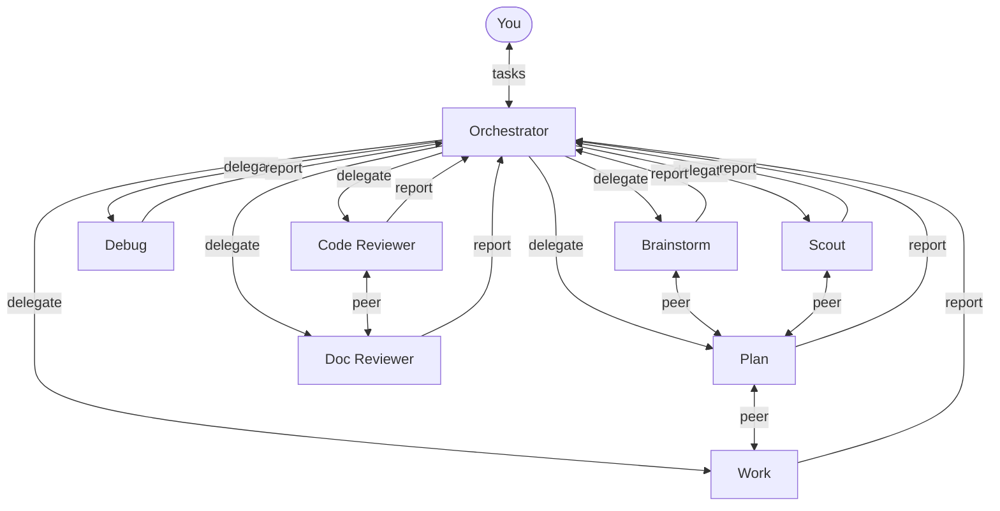
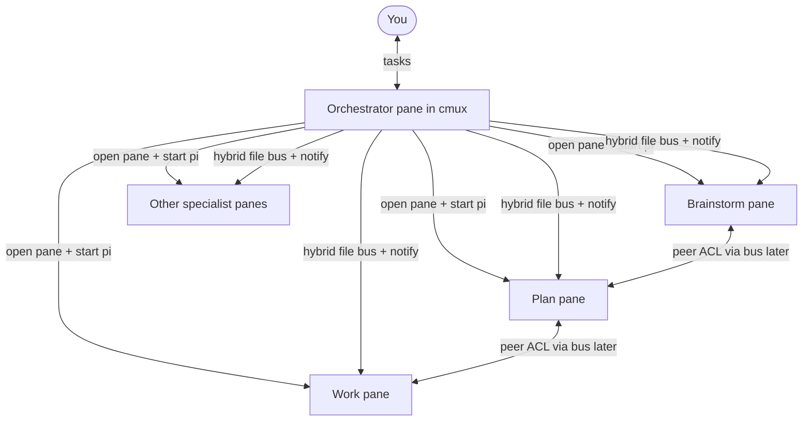
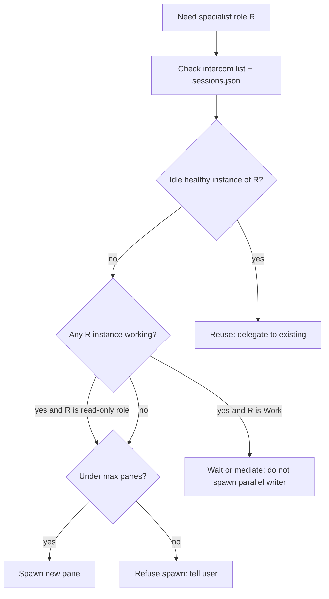
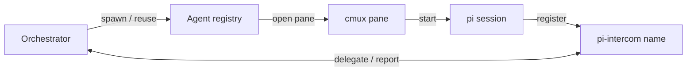
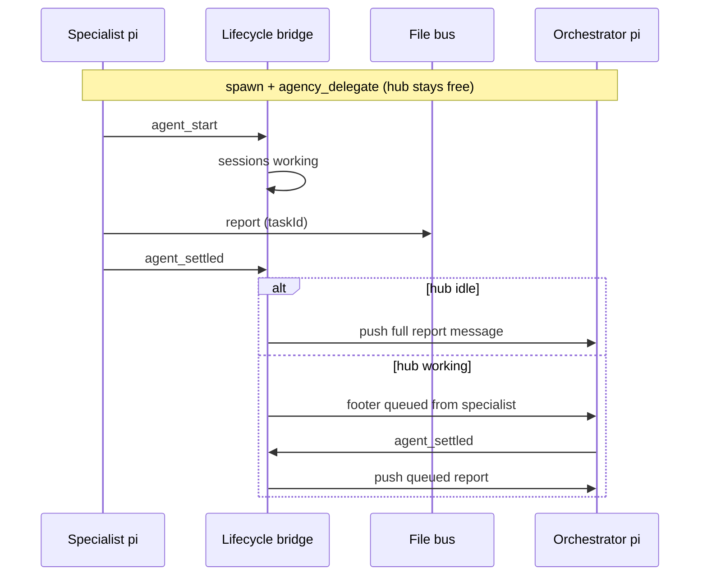
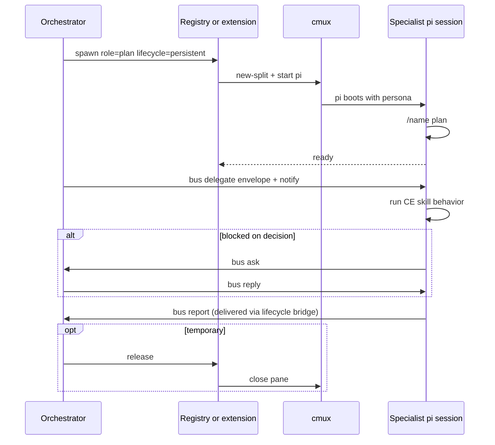
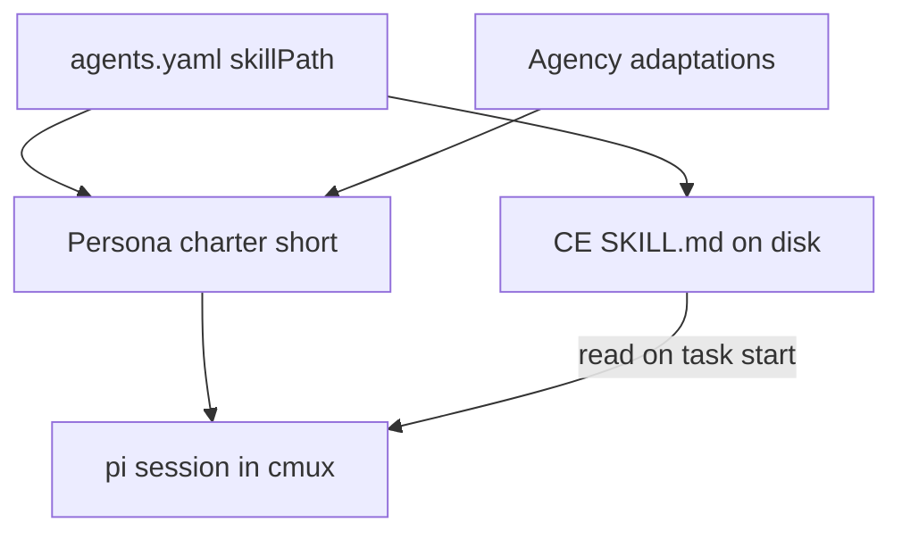
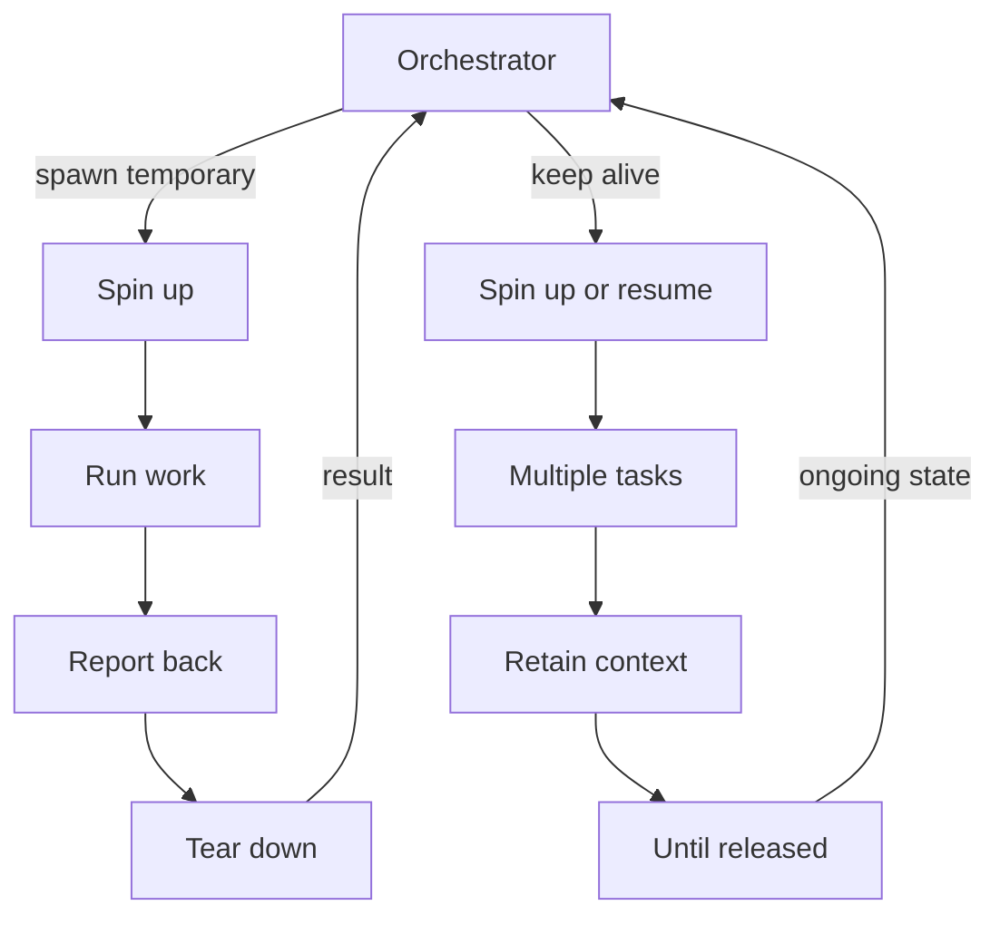
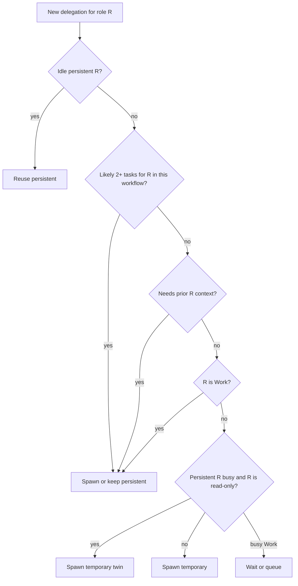
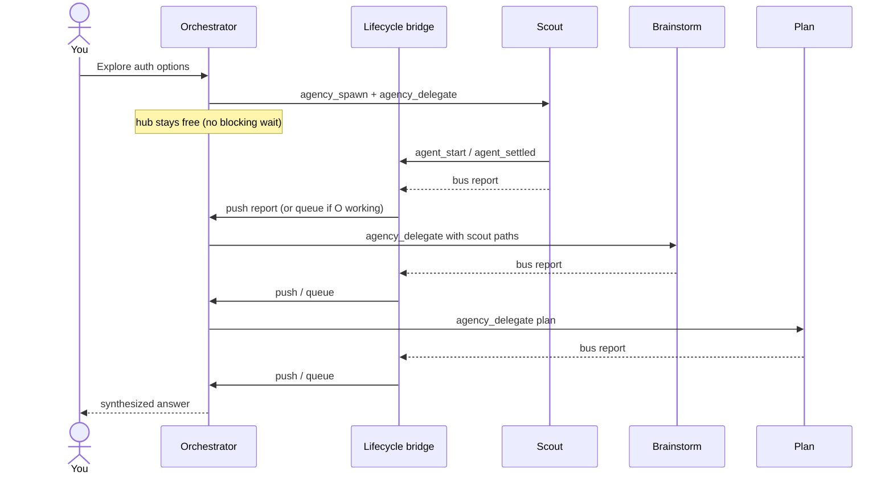

# Multi-Agency Architecture (v0)

High-level design for a pi-based multi-agent system with an orchestrator and compound-engineering-inspired specialist sub-agents.

**Living review board:** open [`architecture.html`](./architecture.html) in a browser — this page is updated whenever the architecture changes.

## Overview

- **You (external user)** talk only to the **Orchestrator**.
- The **Orchestrator** routes each request to the right specialist sub-agent.
- **Sub-agents** inherit behavior from compound-engineering skills (brainstorm, plan, work, debug, code review, doc review, scout).
- **Every sub-agent runs in its own [cmux](https://cmux.com/docs/getting-started) pane** — a native macOS terminal workspace for managing multiple AI coding agents side by side.
- **Inter-agent communication (revisiting):** Phase 1 used [pi-intercom](https://github.com/earendil-works/pi-intercom); live-run pain led us to **hybrid file bus + cmux notify** — see [Communication Transport](#communication-transport-revisiting).
- **Completion path (v0.3):** [Pi lifecycle bridge](#pi-lifecycle-bridge-v03--shipping) — hub stays free after delegate; pi `agent_*` events for busy/idle; bus `report`/`ask` for task done; idle hub gets a **pushed** message, busy hub gets a **queued** banner. Blocking `agency_wait` is superseded.
- **Hub lock (v0.2):** Orchestrator must not implement product work — tools allowlist + persona bans.
- **Sub-agents** may talk to each other under explicit communication rules; all can report back to the Orchestrator.
- The **Orchestrator** may relay or mediate between sub-agents when needed.
- **Sub-agents** can be **temporary** (spin up for one task, then tear down) or **persistent** (stay alive across requests). The Orchestrator decides which mode to use per agent. Temporary panes also **auto-close after 5 minutes idle** post-`agent_settled` (per-pane timer; hub need not release).

## Architecture Diagram



## Runtime and Infrastructure

Each specialist sub-agent is a **pi session inside a cmux pane**. The Orchestrator session also runs in cmux. Agents do not share a single terminal — each gets its own visible workspace.



> **Note:** An older draft of this diagram used pi-intercom edges. **Current transport is hybrid file bus + cmux notify**; pi-intercom is demoted. Lifecycle events (`agent_*`) are per-pane and bridged via the extension — see [Pi lifecycle bridge](#pi-lifecycle-bridge-v03--shipping).
### Why cmux

[cmux](https://cmux.com/docs/getting-started) is a lightweight native macOS terminal (Ghostty-based) built for running multiple AI coding agents at once.

| Capability | Why it matters for multi-agency |
|------------|--------------------------------|
| **Vertical tabs / workspaces** | One pane per sub-agent — easy to see who is running, switch context, and keep agents isolated |
| **Notification panel** | Surface agent completions, blockers, and escalations without hunting through terminals |
| **CLI + socket API** | Orchestrator can automate pane creation, naming, and notifications (`cmux list-workspaces`, `cmux notify`, etc.) |
| **Session restore** | Layout, cwd, and supported agent sessions (including **pi** via `cmux hooks setup`) survive relaunch — persistent agents can resume with `pi --session <id>` |
| **Agent hooks** | cmux captures native pi session IDs so panes can be restored instead of cold-started |

### Why pi-intercom (Phase 1 attempt)

[pi-intercom](https://github.com/earendil-works/pi-intercom) was the first message bus: `send` / `ask` / `reply` / `list` between named pi sessions.

**Live-run friction:** name lag (`/name` not immediately listable), 10-minute blocking `ask` timeouts with no progress channel, soft identity (prompt-only trust), hard to audit mid-flight, and external sessions cannot drive cmux topology. We are **replacing intercom as the primary bus** — see [Communication Transport](#communication-transport-revisiting).

## Spawn Rules (v0)

**Authority:** only the **Orchestrator** may open, reuse, promote, or release sub-agent panes. Specialists never spawn siblings.

**Phase 1 implementation:** Orchestrator skill + cmux CLI + `sessions.json` (Options A + B). Phase 2 moves the same rules into the lean extension (`spawn` / `list` / `release`).

**Constraint:** the cmux control socket only accepts clients **started inside cmux**. The Orchestrator session (and any shell that runs `cmux new-split` / `cmux send`) must live in a cmux pane. Cursor/Telegram shells outside cmux can open the app (`cmux <path>`) but cannot drive pane topology.

**Live run:** `.pi/agency/PHASE1-LIVE-RUN.md` · bootstrap: `.pi/agency/scripts/phase1-bootstrap.sh`

### Decision: open vs reuse

Before every delegation, the Orchestrator runs this check:



| Situation | Action |
|-----------|--------|
| Persistent instance of role exists, status `idle`, intercom name reachable | **Reuse** — send new delegation packet |
| Persistent instance exists, status `working` | **Do not steal** — wait, or (read-only roles only) spawn a **temporary** parallel instance |
| Role is **Work** and any Work instance is `working` | **Never** spawn a second writer — queue or ask user |
| No instance | **Spawn** if under capacity |
| Manifest says alive but intercom `list` missing | Treat as **dead** — clear/stale-mark row, spawn fresh |
| At max concurrent specialist panes | **Refuse** spawn; report to user |

**Capacity (v0 default):** max **6** specialist panes at once (fits the 7-role lineup with room to leave one role unspawned). Orchestrator pane does not count.

### Naming

| Kind | Intercom `/name` | Example |
|------|------------------|---------|
| Orchestrator | `orchestrator` | fixed |
| Persistent specialist | role id only | `plan`, `work`, `scout` |
| Temporary specialist | `role-t{short}` | `scout-t3f2`, `coderev-ta91` |

- Role ids are lowercase: `brainstorm`, `plan`, `work`, `debug`, `coderev`, `docrev`, `scout`.
- Temporary names must be unique in `sessions.json` for the session.
- Reused persistent agents **keep** their name across tasks.

### Working directory (cwd)

| Agent | cwd |
|-------|-----|
| Orchestrator + specialists (default) | Project root |
| Scout `reference-repo` mode | Optional spawn `--cwd` / `agency_spawn.cwd` = reference checkout; `AGENCY_ROOT` still points at **this** project's `.pi/agency` |

Scout skill (custom, not ce-ideate/ce-sweep): `.pi/agency/skills/scout/SKILL.md` — modes `repo-recon` \| `prior-art` \| `reference-repo`.

### Boot sequence (new pane)

1. Write pending row to `.pi/agency/sessions.json` (`status: starting`).
2. `cmux new-split right` (or equivalent) for a visible pane.
3. Start pi in that pane with the persona bootstrap (Phase 1: skill/prompt; Phase 2: `.pi/agents/<role>.md`).
4. Child runs `/name <intercom-name>`.
5. Orchestrator polls `intercom({ action: "list" })` until the name appears (timeout ~60s).
6. Mark row `idle` / `ready`, store cmux surface id + pi session id when known.
7. Send the **delegation packet** via intercom `send` or `ask`.

If step 5 times out: mark `failed`, close pane if possible, report to user. Do not leave orphan `starting` rows.

### Teardown and release

| Mode | When | Action |
|------|------|--------|
| **Temporary** | Task reports complete (or fails / times out) | Orchestrator `release`: close cmux pane, remove or archive manifest row |
| **Persistent** | Task complete | Mark `idle`; **keep** pane open |
| **Persistent** | Explicit release / workflow done / user asks | Close pane; clear manifest row |
| **Promote** | Temp agent still needed for multi-step work | Rename to persistent role name if free, or keep `role-t*` and set `lifecycle: persistent` |
| **Stale** | Pane gone / intercom unreachable | Clear manifest; do not reuse |

**Hooks:** prefer `cmux hooks setup` for pi so persistent agents can resume with `pi --session <id>` after cmux relaunch. Phase 1 may skip full hook wiring if resume is not required for the prototype exit criteria.

### Parallelism rules (v0)

- **Max specialist panes:** `spawn.maxSpecialistPanes` = **6** (Orchestrator pane not counted).
- **Work:** at most **one** instance total. `allowWorkTwin: false` — never twin; queue.
- **Plan:** prefer reuse of idle persistent `plan`. If Plan is `working` and another Plan task is needed, Orchestrator may spawn **one** temporary `plan-t*` twin (`allowPlanTempTwin: true`, `maxTempTwinsPerRole: 1`).
- **Other advisory roles:** at most one persistent per role; temps allowed under the global pane cap.
- Orchestrator prefers sequential Scout → Brainstorm → Plan reuse when possible.

### Manifest fields (spawn-related)

Each `sessions.json` row should carry at least:

`instanceId`, `role`, `intercomName`, `lifecycle` (`temporary` | `persistent`), `status` (`starting` | `idle` | `working` | `blocked` | `interrupted` | `failed`), `cmuxSurfaceId?`, `piSessionId?`, `cwd`, `taskId?`, `nudgeCount?`, `createdAt`, `updatedAt`

**v0.3 status source:** prefer pi lifecycle hooks (`agent_start` → `working`, `agent_settled` → `idle`) over only flipping status on `agency_delegate` / `agency_release`. `interrupted` / abandon paths set by the lifecycle bridge when nudge produces no `agent_start`.

## Sub-Agent Core Architecture

**Decision:** we will **not** use the `pi-subagents` extension. We are building our own, smaller orchestration layer. We can borrow ideas from pi-subagents (task contracts, named sessions, orchestrator-only spawn authority) but we do not want its full feature surface.

### What a sub-agent is (runtime model)

Regardless of implementation option, a sub-agent is always three things bound together:

| Layer | What it is |
|-------|------------|
| **Persona** | A fixed specialist role (Brainstorm, Plan, Work, …) grounded in a compound-engineering skill |
| **Process** | A dedicated **pi session** in its own **cmux pane** |
| **Address** | A stable **pi-intercom name** the Orchestrator uses to delegate and collect results |



**Agent type** (template) — defined in repo config: role id, CE skill path, allowed tools, peer ACL, default lifecycle (temp vs persistent).

**Agent instance** (runtime) — one live pi session: instance id, intercom name, cmux surface id, pi session id, status (`idle` / `working` / `blocked` / `done`), optional bound task id.

**Delegation packet** — what the Orchestrator sends on each assignment:

- **Goal** — concrete outcome for this turn
- **Context** — file paths, prior artifacts, decisions already approved (pass paths, not pasted content)
- **Success criteria** — what must be true before the agent can finish
- **Constraints** — hard rules (e.g. read-only for reviewers, Work is sole writer)
- **Output** — expected artifact shape or summary format
- **Stop rules** — when to `ask` the Orchestrator vs finish

Only the **Orchestrator** may spawn, release, or route between specialists. Sub-agents do not spawn siblings unless we add that explicitly later.

### What we are not taking from pi-subagents

| pi-subagents feature | Our stance |
|----------------------|------------|
| Built-in agent roster (`scout`, `planner`, `worker`, …) | **Skip** — we define our own CE-based personas |
| Chain / parallel / async orchestration DSL | **Skip** — Orchestrator sequences work explicitly |
| `context: fork` / fresh-context machinery | **Skip** — each cmux pane is already an isolated session |
| Worktree isolation, clarify TUI, scheduled runs | **Skip** — out of scope for v0 |
| `contact_supervisor` / nested subagent depth | **Skip** — flat specialists; escalate via intercom to Orchestrator |
| Runtime agent CRUD via tool | **Defer** — agent types are repo-defined, not invented per task |
| Review loops, fanout, dynamic expand chains | **Skip** — workflow logic lives in Orchestrator skill/prompt |

### Implementation options

Four viable shapes for the custom core. All assume **cmux + pi-intercom**; they differ in how much structure sits between the Orchestrator and the shell.

#### Option A — Orchestrator skill + shell only (thinnest)

The Orchestrator is a pi session with a dedicated skill. It spawns children by running **cmux CLI** commands and delegates via **pi-intercom**. No custom extension.

```
Orchestrator pi session
  ├─ reads agents.yaml (types + ACL)
  ├─ cmux new-split + cmux send 'cd repo && pi …'
  ├─ intercom list / send / ask / reply
  └─ optional sessions.json for instance tracking
```

| Pros | Cons |
|------|------|
| Fastest to prototype; minimal code | Fragile; status/lifecycle is ad hoc |
| Full visibility in cmux | Orchestrator prompt carries spawn logic |
| Easy to debug manually | Harder to enforce ACL or teardown consistently |

**Best when:** proving the multi-pane + intercom workflow before writing an extension.

#### Option B — Session manifest registry (filesystem state)

Add a project-local registry (e.g. `.pi/agency/sessions.json`) the Orchestrator reads/writes. Each spawn creates a manifest row: instance id, role, intercom name, cmux surface, pi session id, lifecycle, task id, status.

```
agents.yaml          → static agent types (personas)
sessions.json        → live instances
artifacts/<task-id>/ → delegated outputs
```

Spawn flow: Orchestrator writes manifest → runs cmux/pi boot script → child registers intercom name → Orchestrator verifies via `intercom list`.

| Pros | Cons |
|------|------|
| Debuggable; survives Orchestrator turn boundaries | Still mostly shell-driven unless paired with Option C |
| Clear audit trail of who is running | Need conventions to avoid stale rows |
| Spawn rules become policy on the registry | Two sources of truth unless extension validates |

**Best when:** you want durable instance tracking without building a pi extension yet.

#### Option C — Lean custom pi extension (recommended target)

A small **multi-agency** pi extension replaces pi-subagents with a narrow tool surface:

| Tool action | Purpose |
|-------------|---------|
| `agency_spawn` | Open cmux pane, boot pi with persona, register instance |
| `agency_list` | Connected specialists + manifest status (reconcile first) |
| `agency_delegate` | Send structured delegation envelope via **hybrid file bus** |
| `agency_release` | Tear down temp instance or mark persistent idle |
| `agency_wait` | **Superseded (v0.3):** legacy poll helper only during migration — not the target handoff |

**Async handoff (v0.3 — shipping; supersedes blocking wait):** **spawn → delegate → free hub**. No one-shot `agency_run`. The Orchestrator does **not** block in `agency_wait` for completion. Delivery and liveness come from the [Pi lifecycle bridge](#pi-lifecycle-bridge-v03--shipping). Bus `report` / `ask` remain the **task** truth; pi `agent_*` events remain the **process** truth.

| Situation | Recovery (v0.3) |
|-----------|------------------------|
| Specialist silent after settle, no bus report | Grace → **one** nudge → if no `agent_start`, abandon + respawn + re-delegate |
| Specialist sends report while hub idle | **Push full message** into Orchestrator chat |
| Specialist sends report while hub working | **Queue** + footer banner; deliver on hub `agent_settled` |
| Esc / interrupt mid-work | `agent_settled` without report → same silent-settle path (nudge once) |
| Pane dead | reconcile → release → spawn + re-delegate |

**Historical (v0.2 / Phase 2 golden path):** Orchestrator blocked in `agency_wait(taskId)` and re-waited on timeout. That pattern is **retired** once the lifecycle bridge ships — keep `agency_wait` only as a manual fallback.

### Orchestrator hub lock (v0.2)

The hub freelances when it still has a full coding toolkit and only soft “prefer agency_*” guidance. **Locked mitigation (persona + tools):**

| Layer | Rule |
|-------|------|
| **Persona** | `agents/orchestrator.md` + charter: hard bans — no edit/write of product code, no implement-and-fix loops, always spawn → delegate → (lifecycle delivery) for recon/plan/implement/review/debug |
| **Tools** | Hub process allowlist: `read,grep,find,ls` + `agency_init,agency_list,agency_spawn,agency_delegate,agency_wait,agency_release` — **no** `edit` / `write` / `bash` (`agency_wait` may leave the allowlist after bridge lands) |
| **Launch** | Canonical command from `agency_ctl.py hub-start` (also `/agency-hub`) |

Plain `pi --append-system-prompt .pi/agents/orchestrator.md` without `--tools` is **non-compliant** and will drift into solo coding. Compaction does not remove the system prompt; the tools lock is what removes capability.

**Implemented (v1 control plane):** package `extensions/multi-agency/` + `agency/scripts/agency_ctl.py` as a thin façade over layered modules (`ledger`, `bus`, `cmux_pane`, `pi_launch`, `hub_delivery`, `recovery`, `agent_spawn`). The extension owns cmux + `sessions.json`; messaging stays on `bus.py` + cmux notify (pi-intercom demoted). Orchestrator-only gate: caller cmux surface must match the claimed orchestrator row (`/agency-claim` or first spawn). Project state after `agency_init` lives under `<project>/.pi/agency/` (scripts stay in the package).

**Roster durability:** `ledger.save_sessions` writes `sessions.json` via temp file + atomic rename; `load_sessions` retries briefly on empty/partial reads so concurrent lifecycle status updates cannot break hub `ack-delivery` after a report was already pushed.

**Ops observer (v0.3+):** `agency_ctl observe` serves a localhost dashboard projecting `sessions.json` + inbox stages. Optional `AGENCY_EVENTS=1` appends `.pi/agency/events.jsonl` from thin emit hooks (ledger/bus/cmux/recovery) — timeline aid only; never authoritative. UI attaches anytime; claim is a roster badge. Two projects each use their own `AGENCY_ROOT`; run a second observer on another `--port` if both UIs are up.

### Pi lifecycle bridge (v0.3 — shipping)

**Status:** implemented in package `extensions/multi-agency/lifecycle.ts` + `agency/scripts/lifecycle_bridge.py` (`agency_ctl lifecycle …`). This **supersedes** Orchestrator-blocking `agency_wait` as the primary completion path.

Pi exposes reliable per-process events (`agent_start`, `agent_end`, `agent_settled`, abort via stream `aborted`, `session_shutdown`). They are **local to each pi process** — a small extension hook in **every** agency pane (hub + specialists) must write shared state and drive delivery. Do **not** confuse process idle with task done.

| Signal | Means | Use for |
|--------|--------|---------|
| `agent_start` | Process is working a turn | `sessions.json` → `working` |
| `agent_end` | One low-level run finished (retry/queue may continue) | coarse; prefer `agent_settled` for idle |
| `agent_settled` | Fully idle — no auto-retry / compact-retry / queued follow-up | `sessions.json` → `idle` |
| Bus `report` / `ask` | Task outcome for a `taskId` | **Only** completion signal for the Orchestrator |
| Esc / `aborted` then settle | Interrupted turn | Treat as silent settle if no report |

**Truth split (locked):**

- **Liveness / busy:** pi lifecycle events  
- **Task done:** hybrid bus envelope (`report` / `ask`) for that `taskId`

#### Specialist recovery after silent settle

```
delegate → expect agent_start (working)
… work …
agent_settled
  ├─ bus report/ask already present → task complete (delivery layer runs)
  └─ no report for this taskId
       → grace ~60s
       → if still no report: exactly **one** nudge to the specialist
            ├─ agent_start observed → revived; keep waiting for bus report
            └─ **no agent_start** within ~15–30s → abandon:
                 release → spawn new → re-delegate **same** taskId
                 wake hub (“specialist abandoned / respawned”)
```

If nudge produces `agent_start` but never a bus report, do **not** auto-abandon under this rule (soft later: second timer). Max **one** nudge per silent-settle episode.

#### Temporary idle auto-close (per pane)

Each **temporary** specialist runs its own timer in its pane extension (Orchestrator does not release):

```
agent_settled  → arm / reset 5-minute idle timer
agent_start    → cancel timer (working again)
5 minutes idle → lifecycle idle-teardown → cmux close-surface + clear sessions row
```

Persistent specialists are never auto-closed by this rule. Hub is never auto-closed.

#### Hub delivery queue

When a specialist bus `report`/`ask` is ready:

| Hub state | Action |
|-----------|--------|
| Idle (`agent_settled`) | **Push the full message** into the Orchestrator session so it can act |
| Working (`agent_start` … not settled) | **Do not interrupt** — enqueue + footer/banner: “Queued report from \<instance\> — delivers when idle” |

On hub `agent_settled` (+ optional ~30s grace): dequeue and push next message; clear banner.

Bus files stay the durable audit trail; push is **delivery UX**, not a second store of truth.



**Draft timers:** grace before nudge 60s; wait for `agent_start` after nudge 15–30s; hub deliver grace after settle ~30s; temporary idle auto-close **5 minutes** after last `agent_settled`.

| Pros | Cons |
|------|------|
| Structured spawn/teardown; enforce ACL at delegate time | Extension code to write and maintain |
| Orchestrator prompt stays high-level | Must handle cmux/pi boot failures cleanly |
| Natural place for spawn rules later | |
| Lifecycle bridge frees hub while specialists run | Cross-pane event bridge must be wired carefully |

**Best when:** moving from prototype to something you run daily.

#### Option D — Pi native agent files as personas

Each specialist is a **`.pi/agents/<role>.md`** file: frontmatter (`name`, `description`, `tools`) + short system prompt. CE skills stay **layered** (read via `skillPath` on delegate — not pasted into the agent body).

**Implemented (v1):** `.pi/agents/{orchestrator,scout,brainstorm,plan,…}.md`. `agency_ctl spawn` starts specialists with:

`pi --approve --name <instance> --append-system-prompt .pi/agents/<role>.md [--tools …]`

The **Orchestrator hub** is started by the human (not `agency_spawn`) with the locked tools allowlist — see [Orchestrator hub lock](#orchestrator-hub-lock-v02) and `agency_ctl hub-start`.

```
.pi/agents/orchestrator.md → hub lock: read/search + agency_* only; hard no-implement bans
.pi/agents/scout.md        → scout charter + bus loop (read-lean tools)
.pi/agents/brainstorm.md   → points at ce-brainstorm skillPath
.pi/agents/plan.md         → points at ce-plan skillPath
agents.yaml                → agentPath + charterPath + ACL + lifecycle + tools
```

| Pros | Cons |
|------|------|
| Personas are version-controlled and diffable | Append-system-prompt + boot paste still two steps |
| Matches pi conventions for custom agents | Specialists often need a post-boot `cmux send` nudge |
| Easy to tune one specialist without touching Orchestrator | |

**Best when:** personas are stable and you want declarative role definitions in-repo.

### Comparison

| | A Shell only | B Manifest | C Extension | D Agent files |
|---|:---:|:---:|:---:|:---:|
| Time to first demo | ★★★ | ★★☆ | ★☆☆ | ★★☆ |
| Spawn reliability | ★☆☆ | ★★☆ | ★★★ | ★★☆ |
| ACL enforcement | ★☆☆ | ★★☆ | ★★★ | ★★☆ |
| Operational visibility | ★★★ | ★★★ | ★★★ | ★★★ |
| Long-term maintainability | ★☆☆ | ★★☆ | ★★★ | ★★★ |

**Decided path:** **A → B**, then **C + D**.

| Phase | What we build | Goal |
|-------|---------------|------|
| **1 — Prototype** | Option A (Orchestrator skill + cmux/intercom shell) + Option B (`sessions.json` manifest) | Prove multi-pane spawn, named intercom routing, temp/persistent lifecycle, and a Scout → Brainstorm → Plan handoff |
| **2 — Durable** | Option C (lean `spawn` / `list` / `delegate` / `release` extension) + Option D (`.pi/agents/<role>.md` personas) | Harden spawn/teardown, enforce ACL at delegate time, keep personas version-controlled |

Phase 1 artifacts (`agents.yaml`, `sessions.json`, boot scripts, Orchestrator skill) carry into Phase 2 — the extension wraps them; we do not throw the prototype away.

### How a sub-agent works once running



**While working:** the specialist follows its CE skill, uses normal pi tools, and only talks outward through the **hybrid file bus** (peers allowed by ACL in later phases). It does not interpret user messages directly — the external user talks to the Orchestrator only. Process busy/idle is observed via pi `agent_*` events (lifecycle bridge).

**Inspiration from pi-subagents we keep:** compact task contracts, meaningful `/name`, Orchestrator as sole spawner, Work as single writer, escalate decisions upward instead of guessing.

## Phase 1 Exit Criteria

Phase 1 is done when the prototype **proves the multi-agency loop end-to-end** with Options A + B — not when every specialist or the lean extension exists. Passing these gates unlocks Phase 2 (Option C + D).

### Must pass (hard gates)

| # | Gate | Status | Evidence |
|---|------|--------|----------|
| 1 | **cmux spawn** | **PASS** | Orchestrator opened specialist panes (`cmuxSurface` / `cmuxPane` in sessions during run) |
| 2 | **Named instance** | **PASS** | Instances named (`scout-t*`, `brainstorm-t*`, `plan`); hybrid uses inbox/`sessions.json` names (was intercom `/name`) |
| 3 | **Manifest** | **PASS** | `sessions.json` showed `starting` → `working` → cleared on release |
| 4 | **Delegation packet** | **PASS** | Hybrid: `bus.py send --type delegate` envelopes under `inbox/plan/pending` (earlier path also used intercom) |
| 5 | **Layered skill bind** | **PASS** | Plan followed ce-plan; wrote/updated `docs/plans/2026-07-12-001-feat-agency-trust-floor-plan.md` without full SKILL paste |
| 6 | **Report back** | **PASS** | Hybrid reports in `inbox/orchestrator/done` (`a45ca5ce`, `77a4468c`); Scout artifact `.pi/agency/artifacts/scout-auth-explore-1.md` |
| 7 | **Golden path handoff** | **PASS*** | Scout → Brainstorm → Plan sequenced by Orchestrator on “auth/trust” prompt; *first legs on intercom, Plan reuse on hybrid* |
| 8 | **Temp teardown** | **PASS** | Temp Scout torn down (no lasting scout row; scout artifact only) |
| 9 | **Persistent reuse** | **PASS** | Plan `auth-explore-plan-2` via bus without new role invent; same `plan` inbox / persistent instance |
| 10 | **Stale recovery** | **PASS** | Seeded dead `scout-tstale` row; `reconcile-sessions.py --force-stale` cleared it; playbook requires reconcile before reuse/spawn. `--check-cmux` available inside cmux. |

\* Acceptable for Phase 1 exit if we record the transport migration mid-run; a clean all-hybrid golden path is nice-to-have, not a hard re-run unless you want it.

### Explicitly out of Phase 1 (do not block exit)

- ~~Lean extension (`spawn` / `list` / `delegate` / `release`)~~ — **Phase 2 Option C v1 done** (`agency_*` + `agency_ctl.py`)
- `.pi/agents/<role>.md` for all seven roles — Phase 2 Option D
- Work, Debug, Code Reviewer, Doc Reviewer in the golden path
- Peer-to-peer specialist messaging (Orchestrator-mediated only is enough)
- ACL enforcement beyond “specialists talk to Orchestrator”
- cmux session-restore / `pi --session` resume after relaunch
- Parallel temporary twins, reference-repo Scout cwd
- Perfect lifecycle heuristics (manual Orchestrator choice is fine)

### Minimum Phase 1 deliverables

```
.pi/agency/agents.yaml
.pi/agency/sessions.json
.pi/agency/charters/*.md
.pi/agency/skills/orchestrator/
.pi/agency/bus-spec.md
.pi/agency/scripts/bus.py
.pi/agency/scripts/reconcile-sessions.py
```

**Status:** deliverables **authored**. Live run + stale recovery **proven**.

### Exit checklist (sign-off)

Phase 1 is complete when all of the following are true:

- [x] Golden path Scout → Brainstorm → Plan completed with you talking only to Orchestrator
- [x] `sessions.json` accurately reflected idle/working during the run (cleared after release)
- [x] One temporary agent was torn down; one persistent agent was reused (Plan via hybrid bus)
- [x] Stale-pane recovery demonstrated once (`reconcile-sessions.py` cleared seeded dead row)
- [x] Notes captured: intercom ask-timeouts / name lag → **hybrid file bus + cmux notify** (feeds Option C)

**Phase 1 exit: COMPLETE (2026-07-12).**

## Agent Roles

| Agent | Skill basis | Primary behavior |
|-------|-------------|------------------|
| **Orchestrator** | TBD | Intake, routing, delegation, synthesis, mediation, sub-agent lifecycle |
| **Brainstorm** | `ce-brainstorm` | Explore ideas, scope, requirements-only plans |
| **Plan** | `ce-plan` | Implementation-ready structured plans |
| **Work** | `ce-work` | Execute plans, ship code |
| **Debug** | `ce-debug` | Reproduce, trace root cause, fix bugs |
| **Code Reviewer** | `ce-code-review` | Structured code review before merge |
| **Doc Reviewer** | `ce-doc-review` | Review requirements, plans, specs |
| **Scout** | research skills | Gather context, repo recon, external grounding |

## Skill Binding (v0)

**Problem:** CE `SKILL.md` files are large (often 200+ lines) and harness-specific (`AskUserQuestion`, slash-command framing, etc.). Dumping the full file into every specialist system prompt wastes tokens and teaches the wrong interaction surface (our specialists talk to the **Orchestrator via intercom**, not the end user).

**Decision:** use **layered binding** — short persona charter in-session + CE skill as the on-disk playbook. Do **not** paste the full `SKILL.md` into the system prompt by default.

### Layers



| Layer | What it contains | Where it lives |
|-------|------------------|----------------|
| **1. Persona charter** | Role id, one-paragraph mission, hard constraints, intercom protocol, ACL, output/stop rules, path to skill file | Phase 1: Orchestrator bootstrap prompt / boot script. Phase 2: `.pi/agents/<role>.md` body (short) |
| **2. CE skill playbook** | Full compound-engineering procedure (phases, principles, output format) | Path in `agents.yaml` → e.g. `compound-engineering-plugin/skills/ce-plan/SKILL.md` (or installed CE package path) |
| **3. Agency adaptations** | Overrides baked into the charter | Always: escalate product questions to Orchestrator via intercom `ask`; never treat Telegram/user as direct; Work = sole writer; follow spawn naming |

### Binding modes considered

| Mode | Approach | Verdict |
|------|----------|---------|
| **Full paste** | Entire `SKILL.md` as system prompt | **Reject** — too large; harness noise; wrong ask-user semantics |
| **Summary only** | Hand-written short prompt, ignore CE file | **Reject** — drifts from CE behavior we want |
| **Layered (chosen)** | Short charter + `read` skill file when starting work | **Adopt** |
| **Distilled excerpt** | Charter includes a maintained ~1–2 screen “Core Principles” pulled from CE | **Optional later** if cold-start quality needs it |

### Runtime behavior

1. On spawn, pi loads the **persona charter** only (plus normal pi project context as configured).
2. First action on a new delegation: specialist **reads** `skillPath` from the charter / `agents.yaml` and follows that playbook for the task.
3. Delegation packet may include `skillPath` override; default comes from agent type.
4. If the skill says “ask the user”, the specialist **translates** that to `intercom ask` → Orchestrator (who may ask you).
5. Artifacts (plans, reviews) still follow CE output locations when they make sense (`docs/plans/`, etc.), unless the packet says otherwise.

### `agents.yaml` fields (skill-related)

```yaml
agents:
  plan:
    skillPath: compound-engineering-plugin/skills/ce-plan/SKILL.md
    binding: layered   # charter + on-demand read
    tools: default     # tighten later (e.g. reviewers read-only)
    peers: [brainstorm, work, scout]
    lifecycleDefault: persistent
```

| Role | Default `skillPath` |
|------|---------------------|
| Brainstorm | `…/ce-brainstorm/SKILL.md` |
| Plan | `…/ce-plan/SKILL.md` |
| Work | `…/ce-work/SKILL.md` |
| Debug | `…/ce-debug/SKILL.md` |
| Code Reviewer | `…/ce-code-review/SKILL.md` |
| Doc Reviewer | `…/ce-doc-review/SKILL.md` |
| Scout | custom / research skill TBD (open) |
| Orchestrator | custom agency skill (not a CE skill) |

### Phase 1 vs Phase 2

| Phase | How the charter is delivered |
|-------|------------------------------|
| **1 (A+B)** | Boot script / Orchestrator sends an initial intercom message: charter text + “read skillPath then execute packet” |
| **2 (C+D)** | `.pi/agents/<role>.md` holds the charter; spawn loads that agent; skill path stays in frontmatter or `agents.yaml` |

**Not decided here:** remaining role charters (Work, Debug, Code Reviewer, Doc Reviewer) when those agents enter scope. Phase 1 charters are authored.

## Charters (Phase 1 authored)

Short persona charters live under `.pi/agency/charters/`. Agent types are registered in `.pi/agency/agents.yaml`. Live instances go in `.pi/agency/sessions.json`.

| Role | Charter | Notes |
|------|---------|-------|
| Orchestrator | `.pi/agency/charters/orchestrator.md` | User-facing hub; spawn/delegate/synthesize |
| Scout | `.pi/agency/charters/scout.md` | Custom recon (no CE skillPath yet) |
| Brainstorm | `.pi/agency/charters/brainstorm.md` | Layered → `ce-brainstorm` |
| Plan | `.pi/agency/charters/plan.md` | Layered → `ce-plan`; persistent default |

Each charter includes: mission, hard constraints, intercom protocol, on-delegation steps, output shape, stop rules, skillPath, peers, lifecycle default.

## Orchestrator Spawn Playbook (Phase 1)

**Authored:** `.pi/agency/skills/orchestrator/SKILL.md` (`agency-orchestrator`).

Operational skill for the Orchestrator session (Options A+B). It encodes:

| Area | What the skill tells the Orchestrator to do |
|------|-----------------------------------------------|
| Bootstrap | `/name orchestrator`, reconcile `sessions.json` vs intercom `list` |
| Classify | Map user intent → Scout / Brainstorm / Plan sequences |
| Lifecycle | Apply role defaults + promote/reuse heuristics |
| Spawn | Manifest `starting` → cmux split → pi → `/name` → wait ~60s → `idle` |
| Delegate | Structured packet (goal, paths, criteria, skillPath, stop rules) |
| Hub | Phase 1: relay specialist↔specialist; answer `ask`s |
| Release | Temp teardown; persistent idle; workflow release |
| Golden path | Temp Scout → Brainstorm → persistent Plan reuse → sign-off gates |

Referenced from `agents.yaml` as `orchestrator.skillPath`. **Rewritten for hybrid bus** (file envelopes + cmux notify; pi-intercom removed from primary path). Phase 2 keeps this policy and moves spawn/teardown into lean extension tools.

**Live run entrypoint:** `.pi/agency/PHASE1-LIVE-RUN.md` (Orchestrator must run inside cmux).

## Sub-Agent Lifecycle

The Orchestrator controls whether each sub-agent is temporary or persistent. Both modes coexist in the same system. In both cases the agent runs as a **pi session in a cmux pane**; lifecycle is about whether that pane/session is torn down or kept alive.

**Spawn rules** define *how* to open/reuse/teardown. This section defines *when* to choose each mode.



| Mode | Behavior |
|------|----------|
| **Temporary** | Fresh context; tear down after the assigned task (or on fail/timeout) |
| **Persistent** | Keep pane + session; mark `idle` between tasks; release only when workflow ends |

### Lifecycle heuristics (v0)

Decide **before** spawn (or when promoting). Prefer the cheaper option that still preserves needed context.



| Signal | Choose |
|--------|--------|
| Idle persistent instance already exists | **Reuse** (do not spawn) |
| Same role needed again in this user workflow (epic / multi-step) | **Persistent** |
| Agent must remember prior turns (open questions, partial recon, plan iterations) | **Persistent** |
| **Work** role (sole writer) | **Persistent** for the active feature; release when feature ships or user says stop |
| One-shot advisory (quick scout, single code review pass) | **Temporary** |
| Parallel burst while persistent of same role is busy (read-only roles only) | **Temporary twin** (if under pane cap) |
| Work already `working` | **Never** temp twin — wait / queue |
| User says “keep Plan around” / “stand up specialists” | **Persistent** |
| User says “one-off” / “throwaway” | **Temporary** |
| Unknown | Default from `agents.yaml` `lifecycleDefault` (below) |

### Role defaults (`lifecycleDefault`)

| Role | Default | Rationale |
|------|---------|-----------|
| Scout | **temporary** | Often one-shot recon; promote if multi-hop research continues |
| Brainstorm | **temporary** | Usually one requirements pass; promote if iterating with you via Orchestrator |
| Plan | **persistent** | Plans iterate; handoff to Work benefits from memory |
| Work | **persistent** | Sole writer; multi-file context across tasks |
| Debug | **temporary** | Scoped incident; promote if long investigation |
| Code Reviewer | **temporary** | Review passes are bursty |
| Doc Reviewer | **temporary** | Same |
| Orchestrator | **persistent** | Always (not a specialist pane policy) |

Overrides: delegation packet or user instruction wins over `lifecycleDefault`.

### Promote and release

| Event | Action |
|-------|--------|
| Temp agent asked a second related task in the same workflow | **Promote** → `lifecycle: persistent` (rename to role id if free) |
| Persistent idle > idle TTL (Phase 1: manual; later: e.g. end of day / user “release all”) | **Release** optional |
| Workflow complete / user “done” / golden path finished and no follow-ups | **Release** all persistents spawned for that workflow (or keep if user wants a standing desk) |
| Temp task complete or failed | Prefer tear down; if the Orchestrator does not release, the pane auto-closes after **5 minutes idle** post-`agent_settled` |
| Temporary idle ≥ 5 minutes (`agent_settled`, no new `agent_start`) | **Lifecycle bridge auto-teardown** (per-pane timer; no hub action) |
| Promote refused (role name taken by another persistent) | Keep `role-t*` name with `lifecycle: persistent` |

### Phase 1 practice

For the golden path **Scout → Brainstorm → Plan**:

- Scout: **temporary** (teardown after recon) — satisfies temp gate
- Brainstorm: **temporary** or **persistent** (either ok; prefer temp if single pass)
- Plan: **persistent**, then send a second small follow-up task to prove **reuse** without respawn
- After sign-off: release Plan (and any leftover panes)

## Communication Transport (revisiting)

**Decided direction:** **hybrid — filesystem message bus + cmux notify/flash for attention.** Peer ACL (who may talk to whom) stays; only the *transport* changes.

### Does cmux give us a message bus?

Short answer: **no dedicated agent-to-agent mailbox.** cmux ([getting started](https://cmux.com/docs/getting-started), [API](https://cmux.com/docs/api), [notifications](https://cmux.com/docs/notifications)) gives **pane control + human attention**, not structured RPC between agents.

| cmux primitive | What it is | Fit for multi-agency |
|----------------|------------|----------------------|
| **CLI / Unix socket** | Create workspaces, splits, focus, `send` text into a surface | Spawn + inject keystrokes / paste a packet into a pane |
| **`cmux notify` / OSC 777/99** | Desktop + in-app notification panel, unread badges, pane flash | Wake Orchestrator / human when a specialist finished or needs input |
| **Notification hooks** | Shell hooks on every notification (JSON in/out) | Optional bridge: hook writes into our file bus or wakes a watcher |
| **Feed / Task Manager** | Human approval banners / task UI | Human-in-the-loop, not agent↔agent payload transport |
| **Read surface / screenshots** | Inspect pane contents | Debug/ops, not a clean message protocol |

**Constraint (unchanged):** control socket only accepts clients **started inside cmux**.

### Options considered

| Option | Shape | Pros | Cons |
|--------|-------|------|------|
| **A. Keep / harden pi-intercom** | Fix naming, poll `list`, avoid long `ask`, use `send` + files | Already wired | Soft identity, ask timeouts, weak audit trail |
| **B. Filesystem bus** | `.pi/agency/inbox/<to>/`, outbox, JSON envelopes, watchers | Durable, diffable, no 10m timeout, ACL on paths | Need poll/watch; not “chatty” |
| **C. cmux `surface.send` as transport** | Orchestrator pastes packets into specialist panes | Native to cmux | Fragile (TTY injection); replies awkward; not structured |
| **D. cmux notify-only** | Attention signals only | Great UX for humans | Too small for delegation packets / artifacts |
| **E. Hybrid (chosen)** | **Files for content**; **cmux notify/flash for attention**; optional `surface.send` only to wake a waiting specialist | Best of B+D; matches “pass paths not content” | Slightly more plumbing |

### Hybrid design (v0) — specified

**Full spec:** [`.pi/agency/bus-spec.md`](../.pi/agency/bus-spec.md)

| Concern | Decision |
|---------|----------|
| Content | JSON envelopes under `.pi/agency/inbox/<instance>/pending\|processing\|done/` |
| Large bodies | `artifacts/<taskId>/` + `payloadPath` |
| Attention | `cmux notify` (CLI preferred); OSC 777 optional from specialist panes |
| Delivery notice | **Poll** (5s idle / 1s when awaiting) — no fswatch in Phase 1 |
| Claim | Atomic rename `pending → processing` |
| Types | `delegate` \| `report` \| `ask` \| `reply` \| `progress` \| `release` |
| Phase 1 peers | Hub-only: specialists only write `inbox/orchestrator/` |
| TTY inject | Optional empty nudge via `cmux send`; never paste full envelopes into the terminal |

```text
.pi/agency/
  inbox/<instance>/{pending,processing,done}/
  outbox/                  # optional audit copies
  artifacts/<taskId>/
  sessions.json
  bus-spec.md
```

**Flow:**

1. Orchestrator writes `inbox/<specialist>/pending/…-delegate.json` (atomic).
2. Orchestrator `cmux notify --title <specialist> --body "delegate <taskId>"`.
3. Specialist polls, claims → `processing/`, works, writes artifact + `inbox/orchestrator/pending/…-report.json`.
4. Lifecycle bridge sees report + hub idle/busy → **push** into Orchestrator chat or **queue + banner** (v0.3). Notify remains a secondary attention signal.
5. Orchestrator synthesizes and continues (does not need to block in `agency_wait`).

**pi-intercom:** optional/legacy; not required for Phase 1 exit once hybrid works.

**Helpers (done):** `.pi/agency/scripts/bus.py` (+ `bus-send` / `bus-recv` wrappers) — `send` / `recv` / `done` / `list` / `init`.

### Peer ACL vs transport

ACL still defines *who may address whom*. Enforcement moves to: writer of the envelope must be allowed `from→to` per `agents.yaml` `peers` (and hub edges). Filesystem layout can mirror ACL (only write into allowed inboxes).

## Communication Rules / Peer ACL (v0)

**Transport (updated):** primary = **filesystem envelopes + cmux notify**; ACL defines allowed `from→to` pairs. pi-intercom demoted to optional/legacy.

**Decision:** use a **static allowlist** in `agents.yaml` (`peers: [...]` per role). No dynamic pairing in v0 — Orchestrator does not invent new peer edges at runtime. Missing edge → Orchestrator **mediates** (forward) or refuses the peer hop.

### Always-on hub edges

| From | To | Allowed |
|------|-----|---------|
| You | Orchestrator | yes (only user entry) |
| Orchestrator | any specialist | yes (`send` / `ask`) |
| any specialist | Orchestrator | yes (`send` / `ask` / `reply`) |

Specialists never message you directly.

### Peer allowlist (specialist ↔ specialist)

Rows = sender, columns = receiver. `Y` = direct pi-intercom allowed. Blank = not allowed (use Orchestrator as intermediary).

| From \\ To | Brainstorm | Plan | Work | Debug | CodeRev | DocRev | Scout |
|------------|:---:|:---:|:---:|:---:|:---:|:---:|:---:|
| **Brainstorm** | — | Y | | | | Y | |
| **Plan** | Y | — | Y | | | | Y |
| **Work** | | Y | — | Y | Y | | |
| **Debug** | | | Y | — | Y | | |
| **CodeRev** | | | | | — | Y | |
| **DocRev** | Y | Y | | | Y | — | |
| **Scout** | Y | Y | | | | | — |

### Why these edges

| Link | Reason |
|------|--------|
| Brainstorm ↔ Plan | Requirements ↔ implementation plan handoff |
| Scout → Brainstorm, Scout → Plan | Recon feeds scoping and planning |
| Plan ↔ Work | Plan clarifies; Work reports progress / asks scope |
| Work → CodeRev | Request review after implementation |
| Work ↔ Debug | Bug found in build; debug may need writer for fix (still one Work writer — Debug advises, Work edits) |
| CodeRev ↔ DocRev | Align code findings with spec/plan issues |
| Brainstorm → DocRev | Spec review of requirements-only plan |
| DocRev → Plan | Plan updates after doc review |

**Not direct (hub only):** Scout ↔ Work, Scout ↔ CodeRev, Brainstorm ↔ Work, Plan ↔ CodeRev, Debug ↔ Brainstorm, etc. Orchestrator relays if needed.

### Phase 1 vs later

| Phase | Peer behavior |
|-------|----------------|
| **Phase 1** | **Hub only** — specialists talk to Orchestrator; peer edges unused even if listed in `agents.yaml` |
| **Phase 2+** | Extension/`delegate` enforces the matrix; illegal peer `send`/`ask` rejected or redirected to Orchestrator |

### `agents.yaml` shape

```yaml
agents:
  plan:
    peers: [brainstorm, work, scout]
  work:
    peers: [plan, debug, coderev]
  scout:
    peers: [brainstorm, plan]
  # ...
```

Temporary instances inherit the **role's** peer list (e.g. `scout-t3f2` may talk to `plan` if Scout→Plan is allowed).

### Mediation rule

If A needs info from B and A↛B is not allowed:

1. A `ask`s Orchestrator with the question + intended target.
2. Orchestrator may `ask`/`send` B, then `reply` to A with the answer.
3. Orchestrator may refuse if the request is out of scope.

## Request Flow (example)



## Open Decisions

1. ~~Sub-agent core implementation~~ — **decided:** A → B prototype, then C + D durable
2. ~~Spawn rules~~ — **decided (v0):** open-vs-reuse algorithm, naming, cwd=project root, boot/teardown, one Work writer, max 6 specialist panes — see [Spawn Rules](#spawn-rules-v0)
3. ~~Skill binding~~ — **decided (v0):** layered charter + on-demand CE `SKILL.md` read; no full paste — see [Skill Binding](#skill-binding-v0)
4. ~~Phase 1 exit criteria~~ — **decided:** 10 hard gates + golden path Scout → Brainstorm → Plan; extension/ACL/peers out of scope — see [Phase 1 Exit Criteria](#phase-1-exit-criteria)
5. ~~Communication ACL~~ — **decided (v0):** static `peers` allowlist in `agents.yaml`; hub mediation otherwise; Phase 1 hub-only — see [Communication Rules / Peer ACL](#communication-rules--peer-acl-v0)
6. ~~Lifecycle policy~~ — **decided (v0):** heuristics + role defaults (Work/Plan persistent; Scout/reviews temp); promote on second related task — see [Sub-Agent Lifecycle](#sub-agent-lifecycle)
7. ~~Communication transport~~ — **decided:** hybrid filesystem bus + cmux notify; pi-intercom demoted — see [Communication Transport](#communication-transport-revisiting)
8. ~~Hybrid bus details~~ — **decided (v0):** envelope schema, inbox layout, poll 5s/1s, CLI notify — see [`.pi/agency/bus-spec.md`](../.pi/agency/bus-spec.md)
9. ~~Bus helpers~~ — **done:** `.pi/agency/scripts/bus.py` (`send`/`recv`/`done`/`list`/`init`)
10. ~~Rewrite Orchestrator playbook for hybrid bus~~ — **done:** skill + Phase 1 charters use `bus.py` + notify
11. ~~Persistent agent memory~~ — **done (v0):** `.pi/agency/memory-spec.md` + `memory.py`; Plan/Work NOTES; Work → `docs/solutions/` via ce-compound
12. ~~Scout scope~~ — **done:** custom `.pi/agency/skills/scout/SKILL.md` (modes repo-recon / prior-art / reference-repo); `agency_ctl spawn --cwd` for reference trees; ce-ideate/ce-sweep not bound
13. ~~Spawn capacity / parallel temps~~ — **done:** max 6; Plan may have one temp twin when busy; Work never twins (`agents.yaml` spawn.*)
14. ~~Charter authoring (Phase 1)~~ — **done** (updated for hybrid bus)
15. ~~Remaining charters~~ — **done:** Work, Debug, Code Reviewer, Doc Reviewer (+ Option D agent files)
16. ~~Phase 1 live run + exit~~ — **COMPLETE:** gates 1–10 PASS (hybrid bus + reconcile stale recovery)
17. ~~Option C lean extension (v1)~~ — **done:** `agency_*` tools + `agency_ctl.py`
18. ~~Option D agent files~~ — **done:** all seven roles under `.pi/agents/`
19. ~~Boot-nudge hardening~~ — **done:** spawn starts `pi … "$(cat bootfile)"` so the first turn begins; optional `--nudge` fallback after boot-wait
20. ~~Option C+D golden path~~ — **proven 2026-07-12:** Scout → Brainstorm → Plan reuse; artifacts `.pi/agency/artifacts/cd-golden-1/`
21. ~~Async handoff API~~ — **superseded (v0.3):** was spawn + blocking `agency_wait`; **target** is spawn → delegate → **lifecycle bridge** delivery (hub stays free). `agency_wait` legacy/fallback only — see [Pi lifecycle bridge](#pi-lifecycle-bridge-v03--shipping)
22. ~~Pi package distribution~~ — **done (v0.1):** `package.json` + `pi install`; `agency_init` scaffolds project state; CE skills vendored under `vendor/compound-engineering/`
23. ~~Orchestrator hub lock~~ — **done (v0.2):** persona hard bans + `--tools` allowlist (no edit/write/bash); `agency_ctl hub-start` / `/agency-hub` — see [Orchestrator hub lock](#orchestrator-hub-lock-v02)
24. ~~Pi lifecycle bridge~~ — **shipped (v0.3):** hook `agent_start` / `agent_settled`; bus = task truth; silent settle → one nudge → no `agent_start` = abandon+respawn; hub idle = push full message, hub busy = queue + banner — see [Pi lifecycle bridge](#pi-lifecycle-bridge-v03--shipping)
25. ~~Temporary idle auto-close~~ — **shipped:** each temp pane arms a 5m timer on `agent_settled`, cancels on `agent_start`, then `lifecycle idle-teardown` without Orchestrator — see [Temporary idle auto-close](#temporary-idle-auto-close-per-pane)

**Soft later (not blocking):** stall timer if nudge starts work but never reports; cmux session-restore / `pi --session` resume; peer ACL enforcement beyond hub mediation; optional `agency_run` sugar; RPC/json runner for specialist boot (bus still durable envelopes). Drop `agency_wait` from hub tool allowlist after bridge is proven in daily use.
