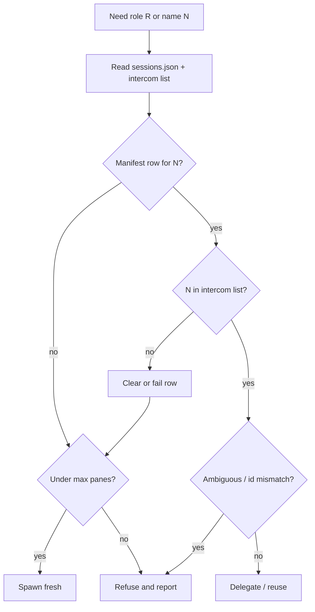
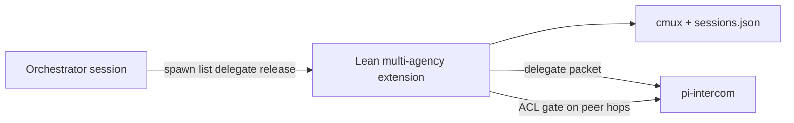

# Agency Trust Floor - Plan

## Goal Capsule

- **Objective:** Define a Phase-aware trust floor for multi-agency so instance identities, live binding, and spawn authority are trustworthy enough for daily Orchestrator-mediated work — without building end-user login.
- **Product authority:** Orchestrator is the sole spawn/release authority and the Phase 1 trust enforcer; specialists claim role/temp names as inbox claimants on the hybrid file bus; the external user never participates on the agency bus.
- **Primary transport:** Filesystem inbox envelopes under `.pi/agency/inbox/` plus cmux notify for attention (see `.pi/agency/bus-spec.md`). **pi-intercom is demoted** — not the primary agency message bus; do not use it for agency traffic.
- **Open blockers:** None for planning. Phase 2 hard ACL and name↔session binding remain deferred by design (see Scope Boundaries).
- **Execution profile:** Docs + Orchestrator skill/charter policy + small manifest helpers for Phase 1; Option C extension hooks designed (not fully built) for Phase 2 ACL/spawn tools.
- **Stop:** Stop when Implementation Units below are done and Verification Contract gates pass — do not build end-user auth or crypto identity.

## Product Contract

### Summary

Multi-agency “auth” is **agency identity + trust + spawn authority** for pi sessions in cmux panes.
**Primary agency transport** is the hybrid file bus (filesystem inbox + cmux notify); pi-intercom is demoted and must not carry agency messages.
This plan locks a trust floor: anti-spoof naming, manifest↔live reconciliation before reuse/delegate, Orchestrator-only spawn/release, and peer ACL hardening timed for Phase 2.
End-user OAuth/JWT/login is explicitly out of scope.

### Problem Frame

Today trust is soft: `/name` is claimable, peer ACL in `agents.yaml` is unenforced, and `sessions.json` can diverge from intercom `list`.
Phase 1 exit already requires stale recovery and Orchestrator-only spawn as policy, but not as an explicit product contract planners can implement against.
Without a trust floor, golden-path and later peer messaging inherit spoof, stale-reuse, and sibling-spawn risks.

### Actors

| ID | Actor | Role in this work |
|----|--------|-------------------|
| A1 | External user | Talks only to Orchestrator; never on the agency bus |
| A2 | Orchestrator | Sole spawner/releaser; Phase 1 trust checks; hub mediation |
| A3 | Specialist instance | Named pi session in a cmux pane; claims role or `role-t*` inbox name |
| A4 | Session manifest | `.pi/agency/sessions.json` rows for live instances |
| A5 | Hybrid file bus | Primary agency transport: filesystem envelopes + cmux notify; pi-intercom demoted (not primary) |

### Scope Boundaries

**In scope**
- Name ownership / anti-spoof rules for persistent role ids and temporary `role-t*` names
- Manifest ↔ live intercom reconciliation as the trust boundary for “who is real”
- Spawn authority: only Orchestrator may open, reuse, promote, or release panes
- Timing of peer ACL: soft (hub-only) in Phase 1; hard enforce/redirect in Phase 2 lean extension
- Failure behavior when trust checks fail (refuse, clear stale, report — not silent reuse)

**Out of scope / non-goals**
- End-user OAuth, JWT, passwords, or any product login (Scout option E)
- Cryptographic agent identity, signed messages, or remote multi-machine trust
- Redesigning peer product workflows beyond hub-only now / matrix later
- Changing the A→B then C+D architecture path or max pane capacity policy except where trust requires refuse-vs-overwrite clarity

### Requirements

**Identity and naming**
- R1. Persistent specialists claim exactly one intercom name equal to their role id (`scout`, `brainstorm`, `plan`, …); Orchestrator claims `orchestrator`.
- R2. Temporary specialists claim unique `role-t{short}` names; uniqueness is required against the live manifest for that project session.
- R3. No instance may claim a name already held by another reachable intercom session; collisions are refused, not overwritten.
- R4. Promote of a temporary instance to a persistent role name succeeds only when that role name is free; if taken, keep `role-t*` with `lifecycle: persistent` rather than silently replacing the other instance.

**Manifest ↔ live trust**
- R5. Before every reuse or delegate, Orchestrator reconciles the target’s manifest row with intercom `list`: name present and healthy → proceed; name missing → treat as stale (clear/archive row, do not reuse).
- R6. Manifest status transitions (`starting` → `idle`/`working`/`failed`/`done`) remain the operational record; a row alone never authorizes trust if intercom disagrees.
- R7. Orphan `starting` rows after boot timeout are marked failed and cleared or archived; they are never treated as live agents.

**Spawn authority**
- R8. Only the Orchestrator may open, reuse, promote, or release specialist panes; specialists must not spawn sibling agents.
- R9. Attempts by a specialist to act as spawner are out of policy; Phase 1 relies on charter/skill constraints; Phase 2 spawn/release tools must make Orchestrator-only authority structural.
- R10. At capacity (`spawn.maxSpecialistPanes`), new spawns are refused and reported — never by hijacking another role’s name or pane.

**Peer ACL timing**
- R11. Phase 1 remains hub-only: specialists talk to Orchestrator; peer edges in `agents.yaml` are declarative foreshadowing, not an enforcement surface.
- R12. Phase 2 lean extension (or equivalent `delegate` gate) must enforce the static peer allowlist: illegal specialist↔specialist hops are rejected or redirected through Orchestrator mediation.
- R13. Temporary instances inherit their role’s peer list when peer messaging is enabled; they do not invent new edges.

### Key Decisions

| Decision | Choice | Rationale |
|----------|--------|-----------|
| D1. Problem framing | Agency identity + trust + spawn authority | Matches architecture and Scout recon; not end-user auth |
| D2. End-user auth | Non-goal | No login product in this repo; would be greenfield |
| D3. Phase split | Soft operational trust floor in Phase 1; hard ACL + structural spawn tools in Phase 2 | Preserves Phase 1 exit gates; aligns with Option C |
| D4. Trust anchor | Manifest + intercom `list` agreement | Already required for stale recovery; cheapest real check |
| D5. Identity strength | Claimed names, not crypto | Same-machine pi-intercom; crypto deferred |
| D6. Name collision / promote | Refuse overwrite; keep `role-t*` if role id taken | Prevents silent spoof of persistent roles |
| D7. Scout options surface | A–D in scope; E out | Orchestrator-locked |

### Success Criteria

- S1. Orchestrator never delegates to a name that is missing from intercom `list` while still listed as live in the manifest.
- S2. A second claimant cannot successfully operate under an already-held persistent role name.
- S3. Specialists do not open new agency panes as part of normal operation; spawn/release remains Orchestrator-only.
- S4. Phase 1 golden-path exit remains achievable without hard peer ACL or crypto identity.
- S5. Phase 2 plan can implement hard ACL and spawn tools without revisiting product scope for A–D.

### Acceptance Examples

- F1. Stale refuse
  - **Given:** Manifest lists `plan` as `idle`, but intercom `list` has no `plan`
  - **When:** Orchestrator needs Plan
  - **Then:** Row cleared/stale-marked; fresh spawn (if under cap); no reuse of the dead row
- F2. Name collision refuse
  - **Given:** Persistent `scout` is reachable
  - **When:** Another session claims `/name scout`
  - **Then:** Collision is not accepted as the trusted Scout for reuse/delegate (refuse or treat as untrusted)
- F3. Promote without overwrite
  - **Given:** Persistent `brainstorm` exists; a temp `brainstorm-t12ab` needs promote
  - **When:** Promote is requested
  - **Then:** Either rename only if free, or keep `brainstorm-t12ab` with `lifecycle: persistent`
- F4. Sibling spawn denied by policy
  - **Given:** A specialist is working a task
  - **When:** It would open another specialist pane
  - **Then:** It does not; it escalates to Orchestrator if more capacity is needed

### Outstanding Questions

- Q1. Whether Phase 2 binds intercom name to `piSessionId` / `cmuxSurfaceId` as a hard check on every message, or only at spawn/delegate time — **resolved in Planning Contract KTD-1** (spawn/delegate-time in Phase 1 and Option C v1; per-message binding deferred).
- Q2. Exact operator-facing error copy when trust checks fail — deferred (non-blocking); implementer may use short refuse phrases in skill text.

### Assumptions

- A1. Trust remains same-machine only for v0 (local filesystem bus + cmux panes).
- A1b. Agency messages use the hybrid file bus only; pi-intercom is not the primary transport.
- A2. Phase 1 enforcement is Orchestrator skill + manifest discipline; specialists comply via charter (no extension yet).
- A3. Existing spawn capacity (max 6 specialists) and hub-only Phase 1 peer behavior stay as already decided in `docs/architecture.md`.

### Sources

- Origin: this file (requirements-only from ce-brainstorm / golden-path handoff)
- Scout: `.pi/agency/artifacts/scout-auth-explore-1.md`
- Architecture: `docs/architecture.md` (Spawn Rules, Peer ACL, Phase 1 exit, Option C)
- Registry: `.pi/agency/agents.yaml`, `.pi/agency/sessions.json`
- Playbook: `.pi/agency/skills/orchestrator/SKILL.md`

---

## Planning Contract

**Product Contract preservation:** Product Contract unchanged (R1–R13, F1–F4, D1–D7 preserved). Planning adds HOW only.

### Key Technical Decisions

| ID | Decision | Choice | Rationale |
|----|----------|--------|-----------|
| KTD-1 | Name ↔ session binding depth | **Spawn readiness + every reuse/delegate** reconcile manifest row with intercom `list` (and prefer matching `piSessionId`/`cmuxSurfaceId` when stored). **Not** every intercom message in Phase 1 or Option C v1. | Satisfies S1–S3 with existing tools; per-message binding needs extension hooks and is deferred (Q1). |
| KTD-2 | Phase 1 enforcement surface | Update Orchestrator skill + specialist charters + optional `sessions.json` helper script; no new pi extension in this plan’s Phase 1 units. | Matches A→B path; keeps Phase 1 exit achievable (S4). |
| KTD-3 | Collision detection | Trusted instance = manifest row whose `intercomName` appears exactly once in intercom `list` and whose stored session/surface ids match when present. Extra claimants of the same name are **untrusted**; Orchestrator must not delegate to an ambiguous name — clear stale row or refuse and report. | Implements R3/F2 without crypto. |
| KTD-4 | Promote algorithm | If target role id free on intercom + absent/unused in manifest → rename to role id. Else keep `role-t*` and set `lifecycle: persistent`. Never overwrite another live row’s name. | R4/F3. |
| KTD-5 | Phase 2 Option C ACL hooks | Extension tools `spawn` / `list` / `delegate` / `release`: `spawn`/`release` Orchestrator-session-only; `delegate` checks hub vs peer allowlist from `agents.yaml` (temps inherit role peers); illegal peer hops reject or redirect to Orchestrator. | R9, R12, R13; S5. |
| KTD-6 | Failure UX | On trust fail: update manifest (`failed` or remove), tell user via Orchestrator, never silent reuse. Exact copy deferred (Q2). | R5–R7, F1. |

### High-Level Technical Design

Trust gate before reuse/delegate (Phase 1 skill; Phase 2 `list`/`delegate`):

Phase 2 Option C tool boundary:

### Assumptions (planning)

- Inferred: Phase 1 Work/Debug/CodeRev roles stay out of golden path; trust floor still documents their ACL edges for Phase 2.
- Inferred: helper script (if added) is bash next to `phase1-bootstrap.sh`, optional for Orchestrator — skill steps remain authoritative if script is skipped.
- External research: skipped — local architecture + scout options A–D are sufficient.

### Deferred to implementation

- Exact refuse/error strings (Q2).
- Whether archived rows go to a sidecar file vs delete-only.
- Full Option C extension code (U5 designs hooks; build is Phase 2 track).

### Deferred to Follow-Up Work

- Per-message name↔`piSessionId` binding.
- Cryptographic agent identity.
- End-user login product.

---

## Implementation Units

### U1. Orchestrator trust-check playbook

**Goal:** Make manifest↔live reconciliation and refuse-vs-reuse behavior mandatory, step-by-step, in the Orchestrator skill before every reuse/delegate.

**Requirements:** R5, R6, R7, S1 — Covers F1

**Dependencies:** None

**Files:**
- `.pi/agency/skills/orchestrator/SKILL.md` (modify)
- `.pi/agency/charters/orchestrator.md` (modify — short trust-floor pointer)

**Approach:**
- Add a **Trust check** section: read `sessions.json` + `intercom list`; require name present; if missing → stale clear; if present but session/surface ids disagree when both known → refuse as ambiguous; never delegate on row alone.
- Codify orphan `starting` timeout → `failed` + clear/archive.
- Wire the existing open-vs-reuse flowchart to this gate explicitly.

**Patterns to follow:** Existing Open vs reuse section in the same skill; architecture Spawn Rules table.

**Test scenarios:**
- Covers F1. Manifest idle `plan`, intercom missing `plan` → skill steps say clear then spawn, not reuse.
- Happy path: idle row + name in list → reuse/delegate allowed.
- Orphan `starting` past timeout → mark failed; not treated as live.
- Ambiguous duplicate name on bus → refuse delegate; report to user.

**Verification:** Skill text contains an explicit pre-delegate checklist; a reader can walk F1 without inventing steps.

---

### U2. Identity, naming, and promote anti-spoof rules

**Goal:** Encode R1–R4 collision/promote policy in Orchestrator skill and specialist charters so second claimants and unsafe promotes are refused.

**Requirements:** R1, R2, R3, R4, S2 — Covers F2, F3

**Dependencies:** U1

**Files:**
- `.pi/agency/skills/orchestrator/SKILL.md` (modify)
- `.pi/agency/charters/scout.md` (modify)
- `.pi/agency/charters/brainstorm.md` (modify)
- `.pi/agency/charters/plan.md` (modify)
- `.pi/agency/agents.yaml` (modify only if naming comments/fields need clarifying — prefer comments or adjacent docs over schema break)

**Approach:**
- Document trusted-name rules: persistent = role id; temp = unique `role-t{short}` vs live manifest.
- Collision: do not accept a second reachable claim of a persistent role as the trusted instance; do not overwrite.
- Promote: rename only if free; else keep `role-t*` + `lifecycle: persistent`.
- Specialist charters: reinforce “do not `/name` steal; escalate naming conflicts to Orchestrator.”

**Patterns to follow:** Architecture Naming table; agents.yaml `intercomName` / lifecycle defaults.

**Test scenarios:**
- Covers F2. Live `scout` exists; second claim → not selected for reuse/delegate.
- Covers F3. Persistent `brainstorm` held; promote temp → keep `brainstorm-t*` persistent.
- Temp name uniqueness: generating a `role-t*` already in manifest → regenerate or refuse spawn.
- Persistent claim equals role id only (no `plan-extra` as trusted Plan).

**Verification:** Promote and collision behaviors are copy-pasteable from skill; charters mention no sibling rename/steal.

---

### U3. Spawn authority constraints (Phase 1 policy)

**Goal:** Make Orchestrator-only spawn/release and capacity refuse explicit; specialists escalate instead of opening panes.

**Requirements:** R8, R9, R10, S3 — Covers F4

**Dependencies:** U1

**Files:**
- `.pi/agency/skills/orchestrator/SKILL.md` (modify)
- `.pi/agency/charters/scout.md` (modify)
- `.pi/agency/charters/brainstorm.md` (modify)
- `.pi/agency/charters/plan.md` (modify)
- `.pi/agency/charters/orchestrator.md` (modify)

**Approach:**
- Orchestrator: at `maxSpecialistPanes`, refuse spawn; never free capacity by hijacking another role’s name/pane.
- Specialist charters: hard constraint — no `cmux new-split`, no spawning peers; if capacity needed → `ask` orchestrator.
- Align Do not lists across charters and skill.

**Test scenarios:**
- Covers F4. Specialist under load needing help → asks Orchestrator; does not open pane.
- At 6 specialist panes → refuse new spawn; user informed; no name steal.
- Only Orchestrator updates `sessions.json` spawn/release fields (policy statement).

**Verification:** Every Phase 1 charter + Orchestrator skill state Orchestrator-only spawn; capacity refuse path documented.

---

### U4. Manifest reconcile helper + live-run trust notes

**Goal:** Optional small helper to list stale/orphan rows against a provided intercom snapshot, plus PHASE1-LIVE-RUN trust checklist items for F1/F2 demos.

**Requirements:** R5, R7, S1, S4

**Dependencies:** U1

**Files:**
- `.pi/agency/scripts/reconcile-sessions.sh` (create) — or equivalent name next to `phase1-bootstrap.sh`
- `.pi/agency/PHASE1-LIVE-RUN.md` (modify)
- `.pi/agency/sessions.json` (schema comment only if needed — prefer script docs)

**Approach:**
- Script reads `sessions.json`, accepts intercom name list (args or stdin), prints stale (in manifest, not in list), orphans (`starting` older than timeout), and optionally writes cleared JSON under Orchestrator confirmation (default dry-run).
- Live-run doc: add trust-floor demo steps for stale recovery and collision refuse without requiring hard ACL.

**Execution note:** Prefer dry-run by default; destructive clear only with an explicit flag so accidental runs do not wipe live rows.

**Test scenarios:**
- Dry-run with fixture: one stale idle row → reported, file unchanged.
- Dry-run: orphan `starting` past timeout → reported.
- Flagged clear: stale row removed; healthy reachable row kept.
- Live-run checklist includes F1-style stale recovery step.

**Verification:** Script runs dry-run against current `sessions.json` without error; live-run doc lists trust demos.

---

### U5. Phase 2 Option C ACL and spawn-authority hooks

**Goal:** Specify (in architecture + short design note) how the lean extension enforces peer ACL and Orchestrator-only spawn/release without revisiting product scope A–D.

**Requirements:** R9, R11, R12, R13, S5

**Dependencies:** U1, U2, U3

**Files:**
- `docs/architecture.md` (modify — Option C / Peer ACL Phase 2 subsection: enforcement hooks)
- `docs/plans/` optional sibling note only if architecture section would be too long — prefer architecture in-place
- `.pi/agency/agents.yaml` (no behavior change; document that `peers` become enforcement input in Phase 2)

**Approach:**
- Document tool gates: `spawn`/`release` only when caller is Orchestrator session; `delegate` loads sender/receiver roles, expands temp → role peers, allow hub always, allow peer if edge in matrix, else reject or auto-redirect via Orchestrator.
- State Phase 1 remains hub-only (R11); hooks are design-ready for implementers of Option C.
- Do **not** implement the extension in this unit — design + doc only.

**Test scenarios:**
- Design lists illegal Scout→Work hop → reject or redirect.
- Temp `scout-t3f2` inherits Scout peers when peer messaging enabled.
- Non-orchestrator caller of `spawn` → rejected in Phase 2 design.
- Phase 1 behavior unchanged: peers still unused operationally.

**Verification:** Architecture Option C / ACL sections name concrete gate points; Work can implement extension later from this plan without product re-litigation.

---

### U6. Architecture trust-floor alignment

**Goal:** Add a concise Trust Floor section (or subsection under Spawn Rules / Peer ACL) so product + planning decisions are visible outside the plan file.

**Requirements:** S4, S5 — traces R1–R13 summary

**Dependencies:** U1–U5 decisions locked

**Files:**
- `docs/architecture.md` (modify)
- `docs/architecture.html` (modify if the living board is maintained in parallel — match existing update practice)

**Approach:**
- Summarize Phase 1 soft trust (reconcile, naming, Orchestrator-only spawn) vs Phase 2 hard ACL/spawn tools.
- Cross-link this plan path.
- Avoid duplicating full unit text; keep architecture as the durable overview.

**Test scenarios:**
- Test expectation: none -- documentation alignment; verify by section presence and consistency with R5/R8/R12.
- Reader can find trust floor without opening the plan file.

**Verification:** Architecture mentions trust floor, stale refuse, and Phase 2 ACL timing; no contradiction with Product Contract.

---

## Verification Contract

This work is policy/docs/script — not an application test suite.

| Gate | How |
|------|-----|
| G1. Stale path | Walk U1 checklist against F1; optional U4 dry-run with a synthetic missing name |
| G2. Collision/promote | Walk U2 against F2/F3 |
| G3. Spawn authority | Confirm charters forbid sibling spawn (F4); capacity refuse in skill |
| G4. Phase 1 exit intact | Trust floor additions do not require Option C or peer messaging for golden path |
| G5. Phase 2 readiness | U5 architecture hooks name `spawn`/`delegate`/`release` gates and peer inheritance |
| G6. Living board | If `architecture.html` is updated in-repo with md, keep them consistent |

No `release:validate` or app unit tests required for this plan.

---

## Definition of Done

- [ ] `artifact_readiness: implementation-ready` sections above are reflected in the repo files named in U1–U6 (this plan is the contract; Work executes units).
- [ ] Product Contract IDs R1–R13 still match implemented policy text.
- [ ] F1–F4 are demonstrable from skill/charter/script text (or live-run checklist).
- [ ] No application/user-login code introduced.
- [ ] Phase 2 ACL/spawn hooks documented for Option C without implementing the full extension unless a later plan says so.
- [ ] Orchestrator can run Phase 1 golden path with trust checks enabled as soft policy.

---

## Appendix

### Scout options map

| Option | Plan coverage |
|--------|----------------|
| A Name ownership / anti-spoof | U2 |
| B Hard ACL | U5 (Phase 2) |
| C Manifest↔live trust | U1, U4 |
| D Spawn authority | U3, U5 |
| E End-user auth | Out of scope |
