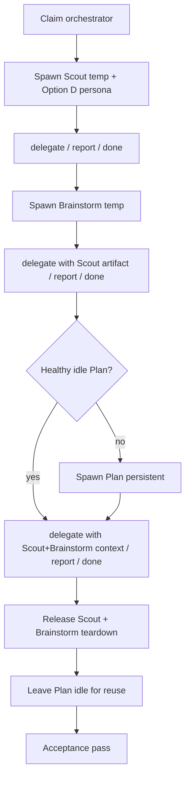
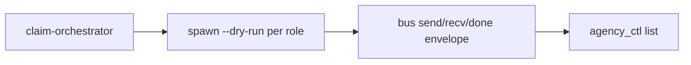

# Option C+D Golden Path Acceptance - Plan

## Goal Capsule

- **Objective:** Define and land what Multi-Agency must **prove and document** as acceptance for the Option C+D golden path — lean control plane (`agency_ctl` + extension tools) plus Option D personas (`.pi/agents/*.md`) over the hybrid file bus — including a **multi-role chain**: Scout → Brainstorm → Plan (persistent reuse).
- **Product authority:** External user talks only to Orchestrator; Orchestrator is sole spawn/delegate/release authority; specialists communicate only via the hybrid file bus (not pi-intercom).
- **Open blockers:** None. Planning resolves prove-vs-document shape (manual primary, optional secondary smoke) and Plan-busy fallback.
- **Stop:** Stop when Implementation Units below are done and Verification Contract gates pass — do not redesign trust-floor, bus ACL, boot-wait hardening, or Phase 2+ roles.

## Product Contract

### Summary

Acceptance for Option C+D is a **demonstrable golden path**: claim Orchestrator, spawn specialists with Option D personas, run a hub-mediated Scout → Brainstorm → Plan workflow on the hybrid bus, then release temporary instances and leave Plan reusable as persistent.
The bar is observable behavior and durable criteria — not a redesign of trust, bus ACL, or Phase 2+ roles.

### Problem Frame

Option C (control plane / lean tools) and Option D (persona files) exist in-repo, and Scout has mapped spawn/boot/bus shape, but there is no small, agreed acceptance definition for “golden path works.”
Without it, Plan cannot distinguish prove-vs-document scope from adjacent trust-floor work or Phase 2 peer messaging.
Phase 1 exit already proved a hybrid mid-run path; this slice requires a clean **all-hybrid Option C+D** acceptance bar.

### Actors

| ID | Actor | Role in this work |
|----|--------|-------------------|
| A1 | External user | Speaks only to Orchestrator; never on the agency bus |
| A2 | Orchestrator | Claims hub; spawns/delegates/releases; mediates the chain |
| A3 | Scout (temp) | Read-only recon; reports grounding for the workflow |
| A4 | Brainstorm (temp) | Requirements-only scoping; reports brief / readiness |
| A5 | Plan (persistent) | Consumes brainstorm artifact; reusable across the path |
| A6 | Hybrid file bus | Primary agency transport under `.pi/agency/` |
| A7 | Option D personas | `.pi/agents/<role>.md` loaded at spawn via append-system-prompt |

### Scope Boundaries

**In scope**
- Acceptance criteria for Option C tools path: `agency_list` / `agency_spawn` / `agency_delegate` / `agency_release` (and/or equivalent `agency_ctl.py` CLI) plus `/agency-claim`
- Acceptance criteria for Option D: spawned specialists boot with the matching `.pi/agents/<role>.md` persona
- Multi-role golden path: **Scout → Brainstorm → Plan**, with Plan using **persistent reuse** (not a fresh Plan pane per run unless reuse is impossible)
- Hybrid bus envelope lifecycle for the chain: delegate → report/ask → reply (as needed) → done; hub-only ACL
- Success criteria, non-goals, and open questions sufficient for Plan to design verification
- Documenting known golden-path risks that affect acceptance (e.g. boot-wait timing) as caveats, not as fix scope

**Out of scope / non-goals**
- Implementing or expanding the trust-floor plan (separate artifact: `docs/plans/2026-07-12-001-feat-agency-trust-floor-plan.md`)
- Phase 2+ roles (work, debug, coderev, docrev) and peer specialist↔specialist envelopes
- Redesigning bus-spec, spawn capacity policy, or replacing pi-intercom (already demoted)
- Hardening boot-wait / cmux send fragility beyond noting it as an acceptance caveat
- End-user auth, crypto identity, or remote multi-machine agency

### Requirements

**Golden path shape**
- R1. Acceptance requires a single Orchestrator-mediated run that exercises **Scout then Brainstorm then Plan** in that order, with each hop using bus `delegate` / `report` (and `ask`/`reply` only if blocked).
- R2. Scout and Brainstorm are temporary instances (`role-t*`); Plan is persistent and **reused** when a healthy Plan session already exists.
- R3. Each specialist must receive work only from Orchestrator and must not spawn peers.
- R4. Context for each delegate must include grounded paths (Scout artifact and/or prior specialist artifact) so the next role does not invent repo state.

**Option C (control plane)**
- R5. Orchestrator can claim the hub (`/agency-claim` or `agency_ctl claim-orchestrator`) and appear as the live `orchestrator` session for the project.
- R6. Orchestrator can list, spawn, delegate, and release specialists through the Option C surface (`agency_*` tools wrapping `agency_ctl.py`, or the CLI itself) with `AGENCY_ROOT` set to `.pi/agency`.
- R7. Release of temporary Scout/Brainstorm instances clears or archives them so they are not treated as live after the path completes; Plan remains available for reuse.

**Option D (personas)**
- R8. Spawn of Scout, Brainstorm, and Plan must load the corresponding `.pi/agents/<role>.md` persona (append-system-prompt / equivalent boot shape from Scout recon).
- R9. Persona frontmatter `tools:` (where present) must constrain the spawned session’s tool surface for that role (e.g. Scout read-oriented tools).

**Bus**
- R10. All agency traffic for the golden path uses the hybrid file bus (`bus.py` send/recv/done); pi-intercom must not carry agency messages.
- R11. Each claimed `delegate` ends in `report` or `ask`; claimed messages move pending → processing → done per bus-spec.
- R12. Large Scout/Brainstorm outputs may live under `.pi/agency/artifacts/<taskId>/` and be referenced by path in later delegates.

**Prove vs document**
- R13. Acceptance includes a **prove** bar: a human or agent can observe the multi-role chain complete (spawn → three-hop workflow → release/reuse) in a real project tree with cmux panes.
- R14. Acceptance includes a **document** bar: a short checklist or criteria doc that Plan can turn into verification steps — this Product Contract is the requirements source for that checklist.

### Key Decisions

- KD1. Multi-role chain is **required** for this acceptance slice (Orchestrator decision B): Scout → Brainstorm → Plan, not Scout-only.
- KD2. Plan lifecycle for the golden path is **persistent reuse**, matching `agents.yaml` `lifecycleDefault: persistent` for Plan.
- KD3. Primary acceptance environment assumes **cmux pane spawn** (real Option C+D). Bus-only smoke without panes is not the primary bar (may be a secondary/CI stretch left to Plan).
- KD4. Trust-floor and C+D golden-path acceptance are separate product slices; golden-path acceptance does not re-specify identity/ACL rules beyond hub-only Phase 1 behavior already implied by bus-spec.

### Success Criteria

- SC1. From a clean or reconciled project agency root, Orchestrator completes claim → spawn Scout → delegate/report/done → spawn or continue Brainstorm → delegate/report/done → reuse or spawn Plan → delegate/report/done.
- SC2. Each spawned role’s session reflects the Option D persona for that role (persona path present in boot / session instructions).
- SC3. Bus inboxes show the expected envelope trail (no reliance on pi-intercom for the chain).
- SC4. Temporary Scout and Brainstorm are released (or equivalently not left as live reusable peers); Plan remains listed and reusable.
- SC5. A durable acceptance brief exists (this artifact) that Plan can enrich without inventing actors, order, or non-goals.

### Assumptions

- A1. `cmux` is available for the prove bar; without it, primary acceptance cannot pass (secondary bus-only bar is optional and unspecified here).
- A2. Phase 1 hub-only ACL is sufficient; hard peer ACL is out of scope for this slice.
- A3. Existing `.pi/agents/{scout,brainstorm,plan}.md` and charters are adequate persona content for acceptance (content quality of skills is not the acceptance target).

### Outstanding Questions

- OQ1. ~~Should Plan’s verification prefer a manual demo checklist, an automated scripted smoke, or both?~~ **Resolved in Planning Contract KTD-1** (manual primary; optional secondary smoke).
- OQ2. ~~Must Brainstorm’s durable output land under `docs/plans/`, artifacts, or either?~~ **Resolved in KTD-2** (either; chain grounding prefers artifacts).
- OQ3. ~~If Plan is busy/failed, spawn-of-fresh-Plan fallback?~~ **Resolved in KTD-3** (prefer reuse; fallback spawn allowed).

### Grounding (from Scout)

- Control plane: `.pi/extensions/multi-agency/index.ts`, `.pi/agency/scripts/agency_ctl.py`
- Bus: `.pi/agency/scripts/bus.py`, `.pi/agency/bus-spec.md`
- Personas / registry: `.pi/agents/*.md`, `.pi/agency/agents.yaml`
- Scout recon: `.pi/agency/artifacts/cd-golden-1/scout-report.md`

---

## Planning Contract

**Product Contract preservation:** Product Contract unchanged (R1–R14, KD1–KD4, SC1–SC5 preserved). OQ1–OQ3 resolved as KTDs below; no product-scope rewrite.

### Key Technical Decisions

| ID | Decision | Choice | Rationale |
|----|----------|--------|-----------|
| KTD-1 | Prove vs document delivery | **Manual cmux demo checklist is primary** acceptance evidence. Optional secondary: scripted smoke for claim/list/`spawn --dry-run` + bus envelope roundtrip without panes. | Matches KD3/R13/R14; cmux + LLM hops cannot be fully automated cheaply; dry-run covers Option C registry wiring for CI stretch. |
| KTD-2 | Brainstorm artifact location | **Either.** Chain grounding must reference paths under `.pi/agency/artifacts/<workflowId>/` (and/or prior specialist artifact). Durable requirements-only unified plans may also land under `docs/plans/` when Brainstorm produces them. Acceptance does not fail if only one location is used, as long as Plan’s `contextPaths` are grounded. | R4/R12; current `cd-golden-1` used both artifacts + `docs/plans/`. |
| KTD-3 | Plan busy/failed fallback | **Prefer `--reuse` / idle persistent `plan`.** If Plan is `working`/`failed`/unreachable after reconcile, Orchestrator may spawn a fresh Plan for acceptance (trust-floor name rules apply). Document the fallback; do not treat busy Plan as hard fail of the golden-path slice. | R2/SC1; avoids blocking acceptance on an unrelated stuck pane. |
| KTD-4 | Option C surface for prove | Either `agency_*` extension tools **or** `agency_ctl.py` CLI is valid evidence, as long as `AGENCY_ROOT=.pi/agency` and the same control-plane semantics are used. Prefer extension tools when Orchestrator has the multi-agency extension loaded. | R5/R6; extension wraps the same CLI. |
| KTD-5 | Option D evidence | Spawn JSON / `piCommand` must show `--append-system-prompt .pi/agents/<role>.md`; Scout must also show `--tools` matching frontmatter. Observing `sessions.json` `agentPath` is supporting evidence. | R8/R9; Scout recon of `cmd_spawn`. |
| KTD-6 | Acceptance caveats (non-fix) | Document boot-wait timing and cmux `send` escaping fragility as known caveats on the checklist; do not implement hardening in this plan. | Product Scope; Scout risks. |

### High-Level Technical Design

Primary prove path (Orchestrator-mediated):

Secondary smoke (optional, no panes):

### Assumptions (planning)

- Inferred: Trust-floor units may land in parallel; this plan must not depend on unfinished trust-floor code beyond existing reconcile/spawn refuse behavior already in `agency_ctl.py`.
- Inferred: Primary checklist lives under `docs/agency/` (operator-facing), with this unified plan remaining the planning authority.
- External research: skipped — Scout recon + local Option C/D code are sufficient.

### Deferred to implementation

- Exact checklist phrasing and checkbox granularity.
- Whether secondary smoke is a Python script under `.pi/agency/scripts/` or a documented shell recipe only.
- Exact sample `workflowId` / task-id naming for the documented demo.

### Deferred to Follow-Up Work

- Boot-wait / cmux send hardening.
- CI job that runs secondary smoke on every PR.
- Phase 2+ roles in the golden path.
- Trust-floor identity work (separate plan).

---

## Implementation Units

### U1. Operator-facing Option C+D acceptance checklist

**Goal:** Land the durable **document** bar: a short checklist an operator or Orchestrator can walk to prove Option C+D golden path acceptance without inventing steps.

**Requirements:** R13, R14, SC1–SC5 — advances KD1–KD3

**Dependencies:** None

**Files:**
- `docs/agency/option-cd-golden-path-acceptance.md` (create)
- `docs/architecture.md` (modify — short pointer from Phase 2 / Option C+D area to the checklist; do not rewrite Phase 1 exit)

**Approach:**
- Structure checklist sections: Prerequisites (cmux, extension or CLI, reconciled agency root) → Claim → Scout hop → Brainstorm hop → Plan reuse hop → Release/teardown → Evidence to capture.
- Each hop lists: Option C action (`agency_*` or `agency_ctl`), expected `sessions.json` status transitions, bus envelope trail (pending → processing → done), and required `contextPaths` grounding.
- Explicit **Plan persistent reuse** step: after first Plan report, leave Plan idle; send a second small delegate to the same `plan` instance without respawn; record evidence.
- Include caveats box (boot-wait, cmux send) per KTD-6; note Plan-busy fallback per KTD-3.
- Architecture change is a single cross-link, not a new exit gate table rewrite.

**Patterns to follow:** Phase 1 exit checklist tone in `docs/architecture.md`; Product Contract actors/requirements IDs for traceability.

**Test scenarios:**
- Happy path: reader can walk claim → three hops → release using only the checklist and existing CLI/tools.
- Plan reuse: checklist requires a second Plan delegate on the same instance name without a new spawn.
- Grounding: Brainstorm and Plan hops require prior artifact paths in `contextPaths`.
- Caveat: checklist documents boot-wait fragility without prescribing a code fix.
- Non-goal guard: checklist does not require trust-floor crypto, peer ACL, or Phase 2+ roles.

**Verification:** File exists; every SC1–SC5 maps to at least one checkbox or evidence line; architecture points to it.

---

### U2. Orchestrator skill Option C+D golden-path runbook

**Goal:** Make the **prove** bar executable from the Orchestrator skill: step sequence for Scout → Brainstorm → Plan reuse using Option C surfaces and hybrid bus only.

**Requirements:** R1–R7, R10–R12, SC1, SC3, SC4

**Dependencies:** U1 (checklist is the human-facing twin; skill mirrors it)

**Files:**
- `.pi/agency/skills/orchestrator/SKILL.md` (modify)
- `.pi/agency/charters/orchestrator.md` (modify — short pointer to C+D acceptance runbook / checklist path)

**Approach:**
- Add an **Option C+D golden path** section: claim → spawn Scout (temp, prefer extension) → delegate with goal/context → wait for report → release Scout teardown → same for Brainstorm → Plan with `--reuse` when idle → second micro-delegate to prove reuse → release temps; idle Plan.
- Require hybrid bus only; forbid pi-intercom for agency traffic in this runbook.
- Require `contextPaths` chaining: Scout artifact → Brainstorm; Scout+Brainstorm artifacts (+ plan path if any) → Plan.
- Document Plan-busy fallback (KTD-3) and Option C surface choice (KTD-4).
- Keep trust-floor pre-delegate checks as pointers if present; do not duplicate the trust-floor plan’s units.

**Patterns to follow:** Existing “Classify the user request” / golden path roles table in the same skill; spawn/release semantics in `agency_ctl.py`.

**Test scenarios:**
- Covers SC1. Skill lists ordered Scout then Brainstorm then Plan hops with bus delegate/report/done.
- Covers R2. Skill prefers Plan reuse; documents fallback spawn.
- Happy path: each hop names Option C tool or `agency_ctl` equivalent.
- Error path: specialist still `starting` → wait/fail before delegate (mirrors `cmd_delegate` guard).
- Integration: Brainstorm delegate packet includes Scout artifact path; Plan packet includes both prior artifacts.

**Verification:** A reader can run the golden path from the skill alone; charter points to skill section and `docs/agency/option-cd-golden-path-acceptance.md`.

---

### U3. Option D persona boot evidence criteria

**Goal:** Specify how acceptance observers prove personas and tool constraints loaded at spawn — without changing spawn code.

**Requirements:** R8, R9, SC2

**Dependencies:** U1

**Files:**
- `docs/agency/option-cd-golden-path-acceptance.md` (modify — Option D evidence subsection)
- `.pi/agency/skills/orchestrator/SKILL.md` (modify — one evidence bullet under golden-path runbook)

**Approach:**
- For each of Scout, Brainstorm, Plan: record spawn response `piCommand` / `agentPath` showing `.pi/agents/<role>.md`.
- Scout: confirm `--tools` includes the frontmatter set (`read,grep,find,ls,bash` or current agent md).
- Brainstorm/Plan: confirm append-system-prompt path; tools optional if frontmatter lists them.
- Acceptance passes on spawn JSON evidence even if the human does not inspect the live TTY prompt text.

**Patterns to follow:** `cmd_spawn` boot shape in `agency_ctl.py` (~448–474); Scout report boot notes.

**Test scenarios:**
- Covers SC2. Spawn Scout → `piCommand` contains `--append-system-prompt .pi/agents/scout.md` and `--tools` matching frontmatter.
- Happy path: Brainstorm/Plan spawn JSON shows matching `agentPath` / append-system-prompt.
- Edge: `spawn --dry-run` registers row with `agentPath` but no cmux pane — valid for secondary smoke only, not primary prove.
- Negative: spawn without agent file missing from evidence → Option D criterion fails.

**Verification:** Checklist and skill both state the exact fields to copy from spawn JSON; no application code changes required.

---

### U4. Secondary bus / dry-run smoke recipe

**Goal:** Optional stretch for CI or no-cmux environments: claim + dry-run spawn registry + bus envelope lifecycle without proving live panes or LLM hops.

**Requirements:** R5, R6, R10, R11 — secondary only (KD3/KTD-1)

**Dependencies:** U1

**Files:**
- `.pi/agency/scripts/option-cd-smoke.sh` or `.pi/agency/scripts/option_cd_smoke.py` (create — pick one; prefer Python if multi-step JSON asserts)
- `docs/agency/option-cd-golden-path-acceptance.md` (modify — “Secondary smoke” section marked non-primary)

**Approach:**
- Script assumes project root cwd; sets `AGENCY_ROOT`.
- Steps: `claim-orchestrator` → `spawn --role scout --dry-run` (and optionally brainstorm/plan dry-run) → `bus.py` send delegate to a temp inbox / or init+send roundtrip using documented test instance → recv/done → assert exit codes and JSON `ok`.
- Must **not** claim primary acceptance on success alone.
- Document that cmux absence fails primary prove but may pass secondary.

**Patterns to follow:** `phase1-bootstrap.sh`, `bus.py` CLI, `prefer-python-over-bash` institutional note when asserting JSON.

**Test scenarios:**
- Happy path: script exits 0 on a clean agency root with Python3; prints clear pass/fail lines.
- Edge: missing `agency_ctl.py` → non-zero with actionable error.
- Negative: script documentation states primary acceptance still requires cmux multi-role prove.
- Integration: dry-run rows appear in `sessions.json` with `agentPath` set; script cleans up or documents leftover dry-run rows.

**Verification:** Script runs locally without cmux; checklist marks it secondary; primary SC1–SC4 still require the manual/cmux path.

---

### U5. Plan spawn reuse identity check (no new pane)

**Goal:** Verification unit for persistent Plan reuse via Option C: `agency_spawn` / `agency_ctl spawn` with `reuse=true` (or `--reuse`) must return the **same** Plan `instanceId` and `cmuxSurface` as the first Plan spawn in the golden path — no new cmux pane.

**Requirements:** R2, SC1, SC4 — advances KD2/KTD-3 prefer-reuse path

**Dependencies:** U1, U2

**Files:**
- `docs/agency/option-cd-golden-path-acceptance.md` (modify — reuse evidence checkbox)
- `.pi/agency/skills/orchestrator/SKILL.md` (modify — one bullet under C+D runbook Plan reuse step)

**Approach:**
- After first successful Plan spawn (or after Plan returns to `idle` post-report), record baseline: `instanceId`, `cmuxSurface`, `intercomName` from spawn JSON / `sessions.json`.
- Call `agency_spawn` with `role=plan`, `reuse=true` (CLI: `spawn --role plan --reuse`).
- Pass only if response `action` is `reuse` and `instance.instanceId` + `instance.cmuxSurface` equal the baseline; fail if a new `instanceId` appears or `cmuxSurface` changes (that implies a new pane).
- Then send the second Plan delegate to that same `intercomName` (bus reuse proof).
- If reuse is impossible (busy/failed), document KTD-3 fallback separately — this unit applies only to the healthy idle reuse path.

**Patterns to follow:** `cmd_spawn` reuse branch (`find_idle_role` → `{action: "reuse", instance: idle}`) in `agency_ctl.py`.

**Test scenarios:**
- Happy path: idle Plan exists → `reuse=true` returns identical `instanceId` and `cmuxSurface`; no new surface created.
- Covers R2. Second Plan hop uses the reused instance without `action: "spawn"`.
- Negative: if ctl returns `action: "spawn"` while an idle Plan row existed → reuse criterion fails.
- Edge: Plan `working` → reuse may not apply; do not force this unit — fall back to KTD-3 and note skip.

**Verification:** Checklist captures before/after `instanceId`+`cmuxSurface` equality; skill runbook requires the same comparison before claiming Plan reuse.

---

## Verification Contract

### Primary gate (required for acceptance)

1. Walk `docs/agency/option-cd-golden-path-acceptance.md` inside cmux with Option C loaded (or CLI equivalent).
2. Complete Scout → Brainstorm → Plan in order with hybrid-bus envelopes only.
3. Prove Plan **reuse**: `agency_spawn`/`spawn --reuse` returns the same Plan `instanceId` and `cmuxSurface` as plan-1 (U5); then second Plan delegate to that instance without respawn (or document KTD-3 fallback if reuse was impossible).
4. Capture evidence: spawn JSON Option D fields; reuse identity fields; `sessions.json` transitions; inbox `done/` envelopes for each hop; temps released; Plan idle/reusable.
5. Confirm Orchestrator skill runbook matches the checklist sequence.

### Secondary gate (optional)

1. Run the U4 smoke script; exit 0.
2. Do not treat secondary pass as Option C+D golden-path acceptance.

### Quality gates

- No new trust-floor, ACL, or boot-wait hardening shipped under this plan.
- Repo-relative paths only in docs and skill.
- Product Contract R/SC IDs remain stable and cited from checklist/skill.

---

## Definition of Done

- U1–U3 and U5 complete; U4 complete or explicitly deferred in the checklist as “not yet authored” without blocking primary acceptance docs/runbook.
- Primary Verification Contract steps 1–5 can be executed by an implementer without inventing hop order or evidence fields (including U5 identity equality on Plan reuse).
- `artifact_readiness` remains `implementation-ready`; no launch-blocking open questions.
- Trust-floor plan and this plan stay separate; no merge of scope.
- Ready for Work: yes.

## Sources & Research

- Origin / Product Contract: this file (requirements from ce-brainstorm via `.pi/agency/artifacts/cd-golden-1/brainstorm-requirements.md`)
- Scout: `.pi/agency/artifacts/cd-golden-1/scout-report.md`
- Control plane: `.pi/extensions/multi-agency/index.ts`, `.pi/agency/scripts/agency_ctl.py`
- Bus: `.pi/agency/bus-spec.md`, `.pi/agency/scripts/bus.py`
- Personas: `.pi/agents/{scout,brainstorm,plan}.md`, `.pi/agency/agents.yaml`
- Sibling plan (non-overlapping): `docs/plans/2026-07-12-001-feat-agency-trust-floor-plan.md`
- Architecture context: `docs/architecture.md` (Phase 1 exit vs Option C+D)
- External research: not load-bearing (skipped)
