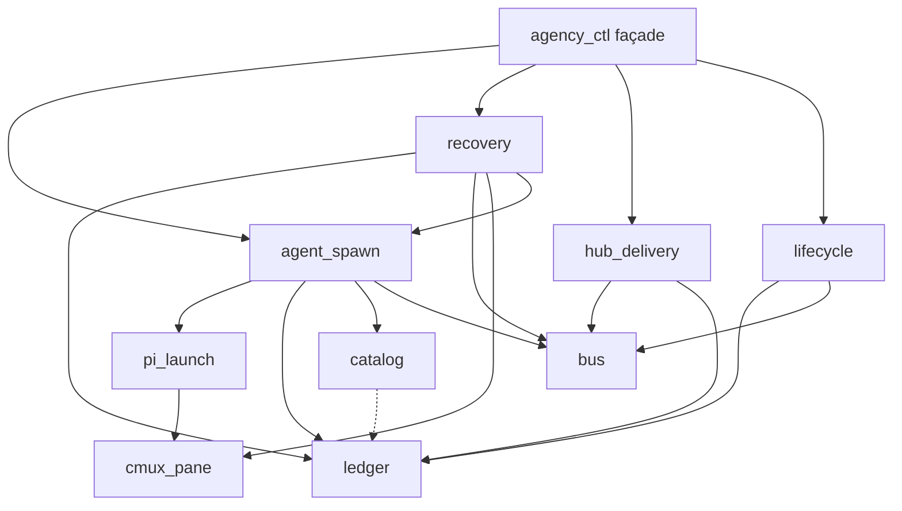
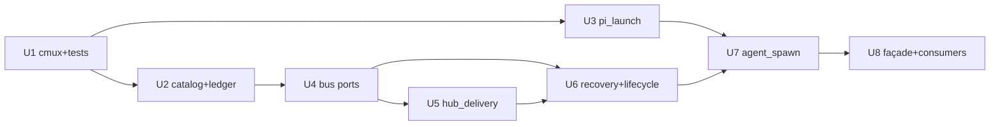

# refactor: Control plane downward layers

## Goal Capsule

- **Objective:** Split the agency control plane into testable downward layers so a change lands in one module and unit tests mock only the layer below — without changing product behavior.
- **Product authority:** Confirmed module map from the user (cmux_pane → pi_launch → bus / catalog / ledger → lifecycle ∥ hub_delivery → recovery → agent_spawn → agency_ctl façade). Architecture and CONTRIBUTING “thin control plane” remain the outer product rules.
- **Stop:** Stop when all Implementation Units below are done, each layer has its unit tests, and CLI / `agency_*` tool argv+JSON parity holds. Do not redesign trust-floor, golden-path acceptance, recovery timers, hub delivery UX, or bus ACL product rules.

## Product Contract

### Summary

The control plane scripts are tightly coupled: spawn, ledger, catalog, cmux I/O, lifecycle status, hub delivery, and recovery all hang off `agency_ctl` / `lifecycle_bridge`. Small edits cascade. This plan extracts the confirmed ten-module DAG, keeps runtime behavior frozen, and adds per-layer unit tests behind injectable ports. Timers stay in the TypeScript extension; Python owns process/task truth and policies. Orchestrator-facing tools stay atomic wrappers over a thin `agency_ctl` façade.

### Problem Frame

`agency_ctl.py` (~860 lines) and `lifecycle_bridge.py` (~750 lines) own mixed concerns; `specialist_spawn` and ctl import each other lazily; there is no Python test harness. Writing unit tests is hard because every path pulls panes, sessions, bus, and policy. The user needs strategic seams so each concern can change and be proven alone.

### Actors

| ID | Actor | Role in this work |
|----|--------|-------------------|
| A1 | Implementer | Extracts modules and lands unit tests bottom-up |
| A2 | Orchestrator agent | Continues to call `agency_*` tools / `agency_ctl` only — internals are invisible |
| A3 | Lifecycle extension | Keeps calling `agency_ctl lifecycle …` with unchanged subcommands and JSON shapes |
| A4 | External user | Unaffected; still speaks only to Orchestrator |

### Key Flows

- F1. Specialist spawn: gate → policy → ledger row → bus/memory init → open pane → launch pi → idle.
- F2. Delegate: mark working → bus send (+ notify).
- F3. Process lifecycle: start/settled/interrupt → ledger status; silent settle arming when no pending hub report/ask.
- F4. Recovery: tick → grace → one nudge → abandon signal → teardown → recovery spawn → re-delegate.
- F5. Hub delivery: claim → format → push or queue+banner → ack (report clears task fields; ask does not).
- F6. Idle teardown / release / reconcile: close (when policy says) and clear ledger via shared primitives.

### Requirements

- R1. Control plane is a downward DAG: higher modules compose lower ones; no lower module imports `agency_ctl`.
- R2. Confirmed modules exist with the stated ownership boundaries: `cmux_pane`, `pi_launch`, `bus`, `catalog`, `ledger`, `lifecycle`, `hub_delivery`, `recovery`, `agent_spawn`, `agency_ctl` façade.
- R3. Runtime behavior is preserved (timers, twin/max/sole-writer policy, soft-fail set, ledger field clears on ack/release, recovery spawn naming, push-fail-after-claim, unused `STARTING_TIMEOUT_SEC`).
- R4. Public CLI (`agency_ctl`, lifecycle remainder commands) and `agency_*` tools keep argv and JSON stdout contracts.
- R5. Each extracted module has unit tests that mock only the layer below (or tempfile FS); no live cmux/pi required for unit proof.
- R6. `memory` and `reconcile-sessions` become thin consumers of ledger/cmux (not new first-class modules in this pass).
- R7. Shared teardown (close surface + clear row) is one primitive used by release, abandon, and idle-teardown.
- R8. Dual spawn entrypoints (`agency_ctl spawn` and `specialist_spawn` CLI) call the same `agent_spawn` function after the cutover.

### Acceptance Examples

- AE1 (R1, R2, R5). Changing cmux close/send logic requires edits only under `cmux_pane` (+ its tests); recovery/spawn tests stay green with a fake pane port.
- AE2 (R2, R3, R7). Changing silent-settle nudge copy or abandon sequence touches only `recovery` (+ tests); hub delivery tests unchanged.
- AE3 (R2, R3). Changing report push vs queue+banner touches only `hub_delivery` (+ tests); recovery tests unchanged.
- AE4 (R4, R8). `agency_spawn` / `agency_ctl spawn` still succeed with the same flags and return shape after façade thinning.
- AE5 (R4). Extension `lifecycle.ts` continues to call the same lifecycle subcommands without TypeScript API redesign.
- AE6 (R6). `memory` and `reconcile-sessions` import ledger/cmux (and shared paths) only — they are not first-class DAG modules.

### Scope Boundaries

#### In scope

- Extract and wire the ten confirmed modules under `agency/scripts/` (layout may use a small `agency/scripts/` package or sibling modules — implementer chooses if imports stay simple).
- Pytest (or equivalent) harness for control-plane unit tests.
- Injectable ports where side effects block tests (cmux runner, bus notify, clock for recovery).
- Keep TypeScript lifecycle timer constants numerically aligned with Python policy constants after moves.

#### Deferred for later

- Trust-floor and golden-path acceptance work (separate plans).
- Opportunistic product cleanups (fix push-fail-after-claim, implement unused starting timeout, soften post-nudge abandon gap).
- Full live cmux/pi E2E suite (optional sealed golden fixtures allowed as a thin cutover gate).
- Promoting `memory` to a first-class layer in the DAG.
- New Orchestrator tools for `claim-orchestrator` / `hub-start` / exposing `--recovery` as a hub tool.

#### Outside this product's identity

- End-user auth, pi-intercom as agency bus, specialist-facing spawn tools, one-shot `agency_run`.

### Key Decisions (product posture)

- Behavior lock: preserve current quirks during the extract; do not “fix while here.”
- Compatibility: existing CLIs and extension argv stay the façade; modules are not a second Orchestrator API.
- Tests: per-module unit/characterization first; live golden path remains a smoke concern outside this plan’s Definition of Done.

---

## Planning Contract

### Assumptions

- `agency_ctl` remains the sole process boundary for the TypeScript extension (no direct TS imports of internal Python modules).
- `claim-orchestrator` / `hub-start` stay slash+CLI boot paths (not new `agency_*` tools).
- `--recovery` and CLI-only spawn flags stay as today (skew with agent tools is intentional).
- External docs research was skipped: architecture is user-settled and local patterns are sufficient.

### Key Technical Decisions

- KTD1. **Downward DAG with façade re-exports.** No extracted module imports `agency_ctl`. During cutover, temporary re-exports from the façade are allowed only until callers move; end state is façade → modules only.
- KTD2. **Extract shared roots before spawn/lifecycle rewrite.** Move `catalog` + `ledger` (and finished `cmux_pane`) out of ctl first so spawn/lifecycle stop depending on ctl for *data* I/O. Gate/reconcile/`import_ctl()` wiring stays until U6–U8; full cycle dissolution is not claimed at U2.
- KTD3. **`pi_launch` is a reusable primitive** below `agent_spawn`; boot “run bus recv” text stays in `agent_spawn` composition, not in `pi_launch` or `bus`.
- KTD4. **Split `lifecycle_bridge` three ways:** `lifecycle` (status/whoami/pending-read including `pending-hub` and silent-settle “has message?” reads), `hub_delivery` (claim/format/ack only), `recovery` (nudge/tick/abandon/idle). Keep `agency_ctl lifecycle …` subcommand names by dispatching inside the façade. Keep file name `lifecycle_bridge.py` as the CLI shim through U8 unless U6 updates `lifecycle_py()` in the same change as any rename.
- KTD5. **Ports for side effects:** `cmux_pane` takes an injectable runner; `bus` takes injectable notify; `recovery` takes an injectable clock. Unit tests never need live cmux.
- KTD6. **In-process calls for Python layers; CLI wrappers remain.** Prefer import between layers after extract; keep thin `python3 script.py` CLIs for humans and for any remaining subprocess callers until those callers migrate.
- KTD7. **One teardown primitive** owned beside `ledger` + `cmux_pane` (thin clear-row + optional close with only the flags release/abandon/idle-teardown already use). Introduced in U6; `cmd_release` switches onto it in U8. Recovery and façade import it — it does not live inside `recovery` alone.
- KTD8. **Test harness:** introduce `agency/scripts/tests/` with pytest + `conftest` path bootstrap mirroring current `sys.path` script style; document invoke as `python3 -m pytest agency/scripts/tests`.
- KTD9. **Paths / env:** either a tiny `agency_paths.py` in U2 or “all layers take `root: Path`; only the façade resolves `AGENCY_*` env.” Do not keep divergent `agency_root()` defaults (`reconcile-sessions` kit-parent vs ctl).

### High-Level Technical Design

Layer DAG (composition only downward):



Incremental cutover (behavior frozen between units):



### Alternative Approaches Considered

| Approach | Why not |
|----------|---------|
| Big-bang rewrite into a Python package | High regression risk; blocks shipping until everything moves |
| Keep god-modules and only add integration tests | Does not solve cascade edits; tests stay brittle |
| Expose each module as new Orchestrator tools | Violates thin Option C surface and agent-native primitive discipline |

### System-Wide Impact

- Orchestrator skills/docs that list `agency_ctl` commands stay valid if façade argv is preserved.
- Extension `lifecycle.ts` unchanged if lifecycle subcommand JSON is preserved.
- Package distribute path ships the whole `agency/` tree via `package.json` `files`; new sibling modules under `agency/scripts/` are included automatically.

### Risks and Dependencies

| Risk | Mitigation |
|------|------------|
| Mid-extract dual teardown / dual YAML parsers diverge | Shared primitive + single catalog loader in U2/U7/U8; characterization tests on soft-fail quirks |
| Import cycles worsen during cutover | Extract catalog/ledger/cmux first; ban module→façade imports in review |
| CLI JSON shape drift breaks extension | U8 parity matrix against current fixtures; keep façade as only TS entry |
| Timer constant drift TS ↔ Python | After recovery extract, assert named constants match or document single source |

### Execution direction

Prefer test-first / characterization for each extract: capture current soft-fail and field-clear quirks in failing tests against the old code path, then move code, then keep tests green. Smoke live cmux only as optional implementer confidence — not Definition of Done.

---

## Output Structure

Expected module layout (adjust if import style needs a package `__init__`):

```text
agency/scripts/
  cmux_pane.py
  pi_launch.py
  catalog.py
  ledger.py
  bus.py
  lifecycle.py          # slim process truth
  hub_delivery.py
  recovery.py
  agent_spawn.py        # supersedes heavy specialist_spawn body
  agency_ctl.py         # thin façade
  memory.py             # consumer
  reconcile-sessions.py # consumer
  tests/
    test_cmux_pane.py
    test_pi_launch.py
    test_catalog.py
    test_ledger.py
    test_bus.py
    test_lifecycle.py
    test_hub_delivery.py
    test_recovery.py
    test_agent_spawn.py
    test_agency_ctl_parity.py
```

---

## Implementation Units

### U1. Finish `cmux_pane` and bootstrap pytest

**Goal:** Complete terminal I/O ownership and land the test harness.

**Requirements:** R1, R2, R5

**Dependencies:** None

**Files:**
- Create: `agency/scripts/tests/test_cmux_pane.py`, `agency/scripts/tests/conftest.py` (or equivalent harness)
- Modify: `agency/scripts/cmux_pane.py`, `agency/scripts/agency_ctl.py`, `agency/scripts/reconcile-sessions.py`, `agency/scripts/lifecycle_bridge.py` (call sites only)
- Test: `agency/scripts/tests/test_cmux_pane.py`

**Approach:** Move surface-alive, identify/caller helpers, close/teardown-surface, and tree-parse helpers into `cmux_pane`. Injectable `cmux_run`/runner for tests. Callers use the module; do not change close semantics.

**Execution note:** Add characterization tests for parse/open/send/close argv first with a fake runner.

**Patterns to follow:** Existing `cmux_pane.open_pane` / `send_to_surface` style.

**Test scenarios:**
- Covers AE1. Happy path: open with direction/focus records expected cmux argv and returns parsed surface id.
- Happy path: send_to_surface with enter true/false builds expected args.
- Edge: surface_alive true/false/unknown when tree text lacks surface.
- Error: find_cmux missing raises clearly.

**Verification:** `cmux_pane` owns all cmux subprocess helpers used by ctl/lifecycle/reconcile; pytest runs via `python3 -m pytest agency/scripts/tests` green for this module.

---

### U2. Extract `catalog` and `ledger`

**Goal:** Separate role config from runtime roster and break façade import cycles.

**Requirements:** R1, R2, R5

**Dependencies:** U1

**Files:**
- Create: `agency/scripts/catalog.py`, `agency/scripts/ledger.py`, `agency/scripts/tests/test_catalog.py`, `agency/scripts/tests/test_ledger.py` (and optionally `agency/scripts/agency_paths.py`)
- Modify: `agency/scripts/agency_ctl.py`, `agency/scripts/bus.py` (agents load), `agency/scripts/specialist_spawn.py`, `agency/scripts/lifecycle_bridge.py`, `agency/scripts/reconcile-sessions.py`
- Test: `agency/scripts/tests/test_catalog.py`, `agency/scripts/tests/test_ledger.py`

**Approach:** `catalog` owns agents.yaml load + fallback parser, role defaults, agent file path, frontmatter tools. `ledger` owns sessions.json load/save, find by name/surface/taskId, create/update/clear rows, counts, idle-by-role, make_instance_name. Twin/max/sole-writer **policy stays in spawn** (not catalog) until U7 — only data helpers move. Unify bus ACL agents load onto catalog. Resolve roots via KTD9. U2 does not claim full import-cycle death — only data independence from ctl.

**Patterns to follow:** Current `load_sessions` / `load_agents` / `parse_agent_frontmatter` behavior including fallback parsers.

**Test scenarios:**
- Catalog: fixture agents.yaml resolves lifecycle/charter/skill/agentPath/tools.
- Catalog: frontmatter tools parsing; missing file behavior matches today.
- Ledger: create/update/clear round-trip on temp sessions.json.
- Ledger: find_idle_role / find_by_task / specialist_count edge empties.
- Error: corrupt sessions file behavior matches current (do not invent new recovery).

**Verification:** Neither catalog nor ledger imports `agency_ctl`; spawn/lifecycle import them for data; bus ACL uses catalog. Full façade cycle break remains U6–U8.

---

### U3. Extract `pi_launch`

**Goal:** Isolate pi argv assembly and first-turn launch from agency policy.

**Requirements:** R2, R5

**Dependencies:** U1

**Files:**
- Create: `agency/scripts/pi_launch.py`, `agency/scripts/tests/test_pi_launch.py`
- Modify: none required for call-sites in this unit (leave `specialist_spawn` helpers until U7 to avoid parallel edit with U2)
- Test: `agency/scripts/tests/test_pi_launch.py`

**Approach:** Move shell-quoting and `build_pi_command` (and optional message/boot file write + open+send orchestration) into `launch_pi(...)` as a new module + unit tests against current command-string fixtures. Do **not** rewire `specialist_spawn` or `hub_start_command` here — hub-start is print-only argv and stays on the façade; spawn call-site switch is U7. No orchestrator gate, no sessions writes, no bus boot prose (caller supplies message/persona/tools).

**Execution note:** Test-first against current command string fixtures from `specialist_spawn`.

**Test scenarios:**
- Happy path: name/tools/persona/message produce expected command and call open then send.
- Edge: no tools / no persona / no message variants.
- Error: cmux open failure propagates; no ledger side effects (none exist in this module).

**Verification:** Unit tests pass with fake `cmux_pane`; spawn still uses legacy helpers until U7 switches to `pi_launch`.

---

### U4. Harden `bus` ports (notify + catalog ACL)

**Goal:** Make bus unit-testable without live cmux; single agents source for ACL.

**Requirements:** R2, R5

**Dependencies:** U2

**Files:**
- Modify: `agency/scripts/bus.py`, `agency/scripts/tests/test_bus.py`
- Test: `agency/scripts/tests/test_bus.py`

**Approach:** Injectable notify callable (default: current cmux notify). ACL loads peers via `catalog`. Keep envelope layout, send/recv/wait/done/init, claim/move-to-done semantics unchanged. CLI entrypoints remain.

**Test scenarios:**
- Happy path: send creates envelope under recipient inbox with expected fields.
- Happy path: recv/claim/done moves file correctly.
- Edge: ACL deny for non-hub peer when Phase-1 hub-only mode on.
- Error: wait timeout returns current shape.
- Integration: notify port invoked on send when configured; silent when notify is no-op.

**Verification:** Bus tests run in tempdir with fake notify; no cmux binary required.

---

### U5. Extract `hub_delivery`

**Goal:** Isolate report/ask delivery path from lifecycle status and recovery.

**Requirements:** R2, R3, R5

**Dependencies:** U2, U4

**Files:**
- Create: `agency/scripts/hub_delivery.py`, `agency/scripts/tests/test_hub_delivery.py`
- Modify: `agency/scripts/lifecycle_bridge.py`, `agency/scripts/agency_ctl.py` (dispatch)
- Test: `agency/scripts/tests/test_hub_delivery.py`

**Approach:** Move `format_delivery_text`, `claim-for-delivery`, and `ack-delivery` into `hub_delivery`. Leave `pending-hub` / silent-settle inbox reads on `lifecycle` (KTD4). Preserve report-vs-ask ledger clears and push-fail-after-claim quirk.

**Test scenarios:**
- Covers AE3. Claim empty inbox → empty result.
- Happy path: claim returns path + envelope; format includes from/type/body fields matching today.
- Happy path: ack report clears taskId/lastDelegate/nudge fields; ack ask does not clear taskId.
- Edge: processing envelopes count as “has message” for silent-settle consumers.
- Error: push failure after claim leaves processing (characterization — do not auto-requeue).

**Verification:** Lifecycle façade still exposes the same subcommand names; hub delivery tests do not import recovery.

---

### U6. Extract `recovery` and slim `lifecycle`

**Goal:** Process truth vs unhealthy-idle policy become separate modules.

**Requirements:** R2, R3, R5, R7

**Dependencies:** U2, U4, U5

**Files:**
- Create: `agency/scripts/recovery.py`, `agency/scripts/lifecycle.py` (or slim `lifecycle_bridge.py` in place then rename), `agency/scripts/tests/test_recovery.py`, `agency/scripts/tests/test_lifecycle.py`
- Modify: `agency/scripts/agency_ctl.py`, callers that subprocess lifecycle
- Test: `agency/scripts/tests/test_recovery.py`, `agency/scripts/tests/test_lifecycle.py`

**Approach:** `lifecycle` keeps whoami, status mapping (start/settled/interrupt), pending-read helpers (`pending-hub`, has-message). `recovery` owns nudge, tick, abandon, idle-teardown. Introduce shared teardown (KTD7). Prefer keeping `lifecycle_bridge.py` as CLI entry shim; if renaming to `lifecycle.py`, update `lifecycle_py()` in the same change. Until U7, recovery may call spawn through a narrow port — deleted in U8. Injectable clock. Keep TS timer ownership; Python constants stay aligned.

**Execution note:** Characterization-first for tick → nudge-once → abandon signal and recovery spawn naming without `--reuse`.

**Test scenarios:**
- Lifecycle: status matrix (working clears awaiting-nudge; idle with/without pending report; interrupted arms silent settle).
- Recovery tick: grace → nudged once → awaiting → abandon signal; report pending clears silent flags; skip hub / no-task / still-working / nudge-already-used.
- Covers AE2. Abandon uses shared teardown then recovery spawn port then re-delegate; mid-fail after teardown preserves orphan semantics.
- Idle-teardown: skip non-temp / working / hub; calls shared release(recovery).
- Edge: race guards between idle-teardown and abandon preserved.

**Verification:** No recovery policy in lifecycle module; façade subcommands still work.

---

### U7. Rewrite `agent_spawn` as composition

**Goal:** Policy + composition only; launch and I/O via lower layers.

**Requirements:** R2, R3, R5, R8

**Dependencies:** U2, U3, U4, U6

**Files:**
- Create or rewrite: `agency/scripts/agent_spawn.py` (may evolve `specialist_spawn.py`), `agency/scripts/tests/test_agent_spawn.py`
- Modify: `agency/scripts/agency_ctl.py`, recovery spawn port (U6)
- Test: `agency/scripts/tests/test_agent_spawn.py`

**Approach:** Compose catalog + ledger + bus.init + optional memory.init + boot text (default or `--message`) + `pi_launch`. Own twin/max/sole-writer and orchestrator gate inside this module (no extra `hub_gate` abstraction). Both CLIs call one function. Wire recovery’s spawn port to the same function. Preserve soft-fail quirks listed under Planning / flow analysis.

**Test scenarios:**
- Happy path call sequence: gate → reconcile → policy → ledger starting → bus.init → memory? → pi_launch → idle.
- Reuse / dry-run / max-panes / plan-twin / work-sole — catalog+ledger fakes only.
- Spawn open fail / send fail → row `failed`; exception surface matches today.
- Recovery spawn path (`recovery=True`) skips bind/ensure as today and issues a new temp name.
- Integration: dual CLI entrypoints invoke the same function (parametrized smoke).

**Verification:** No raw cmux argv assembly or sessions path math inside spawn beyond ledger API.

---

### U8. Thin `agency_ctl` façade and consumers

**Goal:** CLI/RPC dispatch only; reconcile/memory use ledger/cmux; prove parity.

**Requirements:** R1, R4, R5, R6, R7

**Dependencies:** U5, U6, U7

**Files:**
- Modify: `agency/scripts/agency_ctl.py`, `agency/scripts/memory.py`, `agency/scripts/reconcile-sessions.py`, docs only if command lists drift
- Create: `agency/scripts/tests/test_agency_ctl_parity.py`
- Optionally touch: `extensions/multi-agency/index.ts` / `lifecycle.ts` **only if** argv bugs are found (prefer zero TS change)
- Test: `agency/scripts/tests/test_agency_ctl_parity.py`

**Approach:** Façade owns argparse, env roots, `require_orchestrator`, and dispatch to modules. Init / claim-orchestrator / hub-start remain setup commands. `delegate` / `wait` / `list` may remain thin composers on the façade (ledger + bus) — not a ninth extraction in this plan. Switch `cmd_release` onto shared teardown (R7). Reconcile uses ledger + cmux tree (“tree unavailable → no clears”). Delete temporary recovery spawn ports and façade re-exports (KTD1 end state). Build a parity matrix of spawn/list/delegate/release/lifecycle subcommands vs pre-refactor fixtures.

**Test scenarios:**
- Covers AE4 / AE5. Each public subcommand still registered; lifecycle remainder forwards to the same logical handlers.
- Covers AE6 / R6. Reconcile and memory import ledger/cmux (or paths) only — not first-class DAG nodes.
- Covers R7. `release` uses the same teardown primitive as abandon/idle-teardown.
- Reconcile: dead surface clears row; tree unavailable clears nothing; force-stale names.
- Tool↔CLI parity: flags used by `agency_*` in `extensions/multi-agency/index.ts` still accepted.
- Error: non-orchestrator spawn still rejected (non-recovery).

**Verification:** Spawn/lifecycle/hub/recovery internals are not reimplemented in ctl; remaining façade composers (`delegate`/`wait`/`list`/`init`) are intentional residuum; no temp ports remain; unit/parity tests green.

---

## Verification Contract

- Gate 1: pytest suite under the new tests path passes without cmux/pi installed (unit scope).
- Gate 2: Import DAG check — no `catalog`/`ledger`/`cmux_pane`/`pi_launch`/`bus`/`lifecycle`/`hub_delivery`/`recovery`/`agent_spawn` module imports `agency_ctl`.
- Gate 3: CLI/tool parity matrix for Orchestrator-facing commands passes (U8).
- Gate 4: Soft-fail characterization scenarios from U5–U7 remain documented in tests (push-after-claim, ack ask vs report, recovery naming).

## Definition of Done

- All U1–U8 complete with their listed test files green.
- Confirmed ten-module ownership boundaries hold (ownership cheat sheet in Appendix).
- Temporary recovery spawn ports and façade re-exports are gone (KTD1 end state).
- Product behavior frozen items from R3 unchanged unless a unit explicitly records a necessary equivalence mapping.
- TypeScript lifecycle bridge still functions against the façade without a new public API.
- Trust-floor / golden-path / live E2E / memory-as-layer remain deferred.

## Appendix

### Ownership cheat sheet

| Change | Module |
|--------|--------|
| Panes open/close/send/alive/tree | `cmux_pane` |
| `pi …` argv / first message launch | `pi_launch` |
| Role defaults / persona / tools config | `catalog` |
| Who is running / status / taskId | `ledger` |
| Shared instance teardown (clear + optional close) | thin helper beside `ledger` + `cmux_pane` |
| Envelope send/recv | `bus` |
| busy vs idle from pi events | `lifecycle` |
| Push/queue reports to hub | `hub_delivery` |
| Nudge / idle close / abandon+respawn | `recovery` |
| Specialist creation policy | `agent_spawn` |
| CLI names / flags wiring | `agency_ctl` |

### Product Contract preservation

Product Contract authored in this bootstrap from the user’s confirmed architecture — no separate brainstorm file. Scope confirmed in ce-plan Phase 0.7 (behavior lock, CLI façade, consumers not modules, no live E2E DoD).

### Sources & Research

- Local: `agency/scripts/*.py`, `extensions/multi-agency/{index,lifecycle}.ts`, `docs/architecture.md`, `CONTRIBUTING.md`
- Prior plans (constraints only): `docs/plans/2026-07-12-001-feat-agency-trust-floor-plan.md`, `docs/plans/2026-07-12-002-feat-option-cd-golden-path-acceptance-plan.md`
- Institutional `docs/solutions/`: none
- External research: skipped (settled design + strong local patterns)
