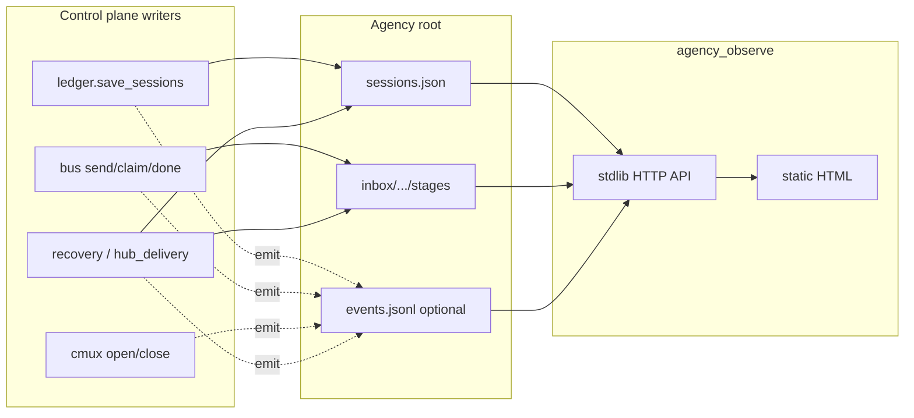

# feat: Agency ops observer (hooks + live UI)

## Goal Capsule

**Objective:** Give operators a live view of Multi-Agency operation — which agents are spawned and their status, bus inbox stages, pane open/close, and a timeline of control-plane moments — without changing control-plane business logic.

**Authority:** `sessions.json` + inbox files remain the source of truth. Optional emit/hooks and `events.jsonl` are a derived timeline, never authoritative. Product intent: thin hooks + separate viewer; no second agency runtime in the UI.

**Stop when:** A local web viewer can attach to any project `.pi/agency`, show roster + inbox + timeline updated from file state and optional emits, and unit tests cover the emit port + projection helpers. Out of scope: remote multi-host dashboards, rewriting lifecycle policies, replacing `agency_wait` / bus protocols.

---

## Product Contract

### Summary

A live **agency ops observer**: local web dashboard projected from project agency state, plus thin optional event emit at choke points. Claim/hub binding is a first-class roster badge, not a gate to open the UI.

### Problem Frame

Operators today must `cat` sessions and inbox dirs (or interrupt the Orchestrator) to see whether Scout is working, whether a report landed, or whether a pane was torn down. The control plane already writes durable state; ephemeral moments (nudge injected, timers armed) are harder to see. We need a read-only ops surface that makes the v0.3 truth split visible — process status vs bus task completion — without coupling the control plane to a UI framework.

### Requirements

- R1. A viewer attaches to a project agency root (`AGENCY_ROOT` / path arg) at any time; claim is displayed as hub bind status, not required to open.
- R2. Roster view shows instances with role, lifecycle, status, taskId, surface/pane identity, and updated timestamps from `sessions.json`.
- R3. Bus view shows each instance’s pending / processing / done stages (at least hub + active specialists), with type / from / to / taskId.
- R4. Timeline shows ordered control-plane moments (spawn/bind, status flips, bus send/claim/done, pane open/close, recovery nudge/abandon/idle-teardown, hub delivery claim/ack) via thin emit into an append-only log when events are enabled. When emit is disabled, the UI keeps roster + inbox useful and shows explicit empty-timeline copy (not a fake derived history).
- R5. Core policies stay unchanged: no new gates on spawn/delegate/release; emit defaults to no-op when unset or sink disabled; tests stay cmux-free via injectable ports.
- R6. Launch is a package CLI (and optional thin docs); no requirement that Orchestrator pi host the UI process.
- R7. Dual-source risk is documented and mitigated: UI must prefer file state for current truth; timeline treats emit as best-effort.

### Actors

- A1. Human operator (developer running Multi-Agency in cmux)
- A2. Control-plane scripts (writers of sessions/bus/cmux)
- A3. Lifecycle extension (writes sessions via bridge; ephemeral timers stay pane-local)

### Key Flows

- F1. Operator starts viewer → points at project `.pi/agency` → sees empty or live roster → as Orchestrator claims / spawns / delegates, UI updates without refresh hacks beyond SSE/poll.
- F2. Specialist works: sessions `working` → bus `report` pending on hub → processing/done + hub delivery → taskId cleared → temp idle-teardown closes pane; timeline + roster reflect each durable step; ephemeral nudge appears if emit fired.
- F3. Viewer with emit disabled still shows usable roster + inbox from filesystem watch alone.

### Acceptance Examples

- AE1. With a temp agency root seeded with one scout `working` and one hub `pending` report, observer API/UI shows both without needing emit.
- AE2. Saving sessions through ledger with emit sink enabled appends a roster event; with sink no-op, behavior unchanged and tests pass.
- AE3. Opening observe CLI against an unclaimed but initialized agency root still serves the UI and shows orchestrator unbound or missing surface.
- AE4. With emit disabled, timeline region shows empty-state copy pointing operators at roster + inbox for durable truth and at enabling `AGENCY_EVENTS` for ephemeral moments.

### Scope Boundaries

**In scope:** emit port + jsonl sink, wire high-value seams, stdlib HTTP observer + static HTML UI, package CLI launch, unit tests, short architecture/README mention.

**Out of scope / deferred:** React/SPA frameworks; remote multi-user auth; editing agency state from the UI; perfect reconstruction of TS-only timers in v1; replacing cmux tree for pane liveness beyond sessions fields + open/close emits.

**Product Contract preservation:** N/A (ce-plan-bootstrap; no upstream requirements-only unified plan).

---

## Planning Contract

### Assumptions

- A1. Operators run the viewer on the same machine as cmux/agency state (local FS access).
- A2. Minimal UI shell is acceptable for v1 (stdlib HTTP + static HTML + SSE/poll); heavier SPA deferred.
- A3. Partial JSON reads of non-atomic `sessions.json` are handled with retry/debounce in the observer.

### Key Technical Decisions

| ID | Decision | Rationale |
|----|----------|-----------|
| KTD1 | **Truth = files; emit = timeline aid** | Matches architecture truth split and user’s “don’t alter core logic” constraint; avoids dual-runtime bugs |
| KTD2 | **Central choke + leaf emits** | Hook `ledger.save_sessions` for roster diffs; leaf hooks on bus stage transitions, cmux open/close, recovery outcomes, hub_delivery claim/ack — mirror `set_notify` / `set_runner` / `set_clock` |
| KTD3 | **Default sink: append `.pi/agency/events.jsonl`** | Diffable, gitignored with other agency state, trivial for SSE tail; `set_emit` / env flag for tests/disable |
| KTD4 | **Viewer is a separate process** | Keeps hub tool lock intact; Orchestrator must not host a web server via bash/`edit` |
| KTD5 | **Stdlib HTTP + static HTML** | Repo has no frontend toolchain; matches package thinness |
| KTD6 | **Attach anytime; claim is a badge** | Confirmed scope; claim starts hub binding but not the agency FS |
| KTD7 | **Do not make emit required for UI usefulness** | F3 / AE1 — filesystem projection works alone |

### High-Level Technical Design

**Event envelope (directional, not a locked schema forever):** `{ ts, type, agencyRoot?, instance?, taskId?, detail }` with stable `type` strings such as `sessions.saved`, `bus.sent`, `bus.claimed`, `bus.done`, `cmux.opened`, `cmux.closed`, `recovery.nudged`, `recovery.abandoned`, `hub.delivery.claimed`, `hub.delivery.acked`.

### Alternative Approaches Considered

| Approach | Why not v1 |
|----------|------------|
| Hooks-only UI (every step must emit) | Breaks when a path forgets emit; fights “files are truth” |
| Claim-gated start | Blocks observing init/spawn-before-claim and recovery |
| SPA / Next.js | Dependency surface disproportionate to ops view |
| Host UI inside Orchestrator pane | Conflicts with hub tool lock and “don’t mutate via hub” |

---

## Implementation Units

### U1. Event emit port and jsonl sink

**Goal:** Add an injectable `emit` port and a default append-only jsonl sink under the agency root, with tests proving no-op default and sink write.

**Requirements:** R4, R5, R7

**Dependencies:** None

**Files:**
- Create: `agency/scripts/agency_events.py`
- Create: `agency/scripts/tests/test_agency_events.py`
- Modify: `agency/scripts/ledger.py` (emit on `save_sessions` with before/after summary)
- Modify: `agency/scripts/tests/conftest.py` (or module autouse) to `set_emit(None)` after each test — mirror `set_notify` reset

**Approach:** Mirror `bus.set_notify`: module-level `_emit`, `set_emit(fn|None)`, `emit(type, **fields)`. Default emit appends one JSON line to `root/events.jsonl` when `AGENCY_EVENTS=1` (default off in tests; document enable for operators). `.pi/` is already gitignored — no `.gitignore` change. `save_sessions` emits compact per-instance deltas; coalesce no-op when nothing material changed (spawn may call save many times).

**Patterns to follow:** `agency/scripts/bus.py` `set_notify`; `agency/scripts/cmux_pane.py` `set_runner`; `agency/scripts/recovery.py` `set_clock`

**Test scenarios:**
- Happy path: enabled sink + `emit("bus.sent", …)` creates/appends valid JSON line under temp root
- Edge: `set_emit(None)` restores default; default with events disabled writes nothing
- Edge: consecutive identical `save_sessions` does not spam duplicate delta lines
- Error: sink write failure must not raise into callers (swallow/log; control plane continues)
- Integration: `save_sessions` with sink enabled records a sessions event; with disabled, no file

**Verification:** pytest for `test_agency_events.py` + existing ledger tests still pass

---

### U2. Wire leaf emit seams (bus, cmux, recovery, hub delivery)

**Goal:** Emit at high-signal moments without changing ACL/spawn/recovery policy.

**Requirements:** R4, R5

**Dependencies:** U1

**Files:**
- Modify: `agency/scripts/bus.py`
- Modify: `agency/scripts/cmux_pane.py`
- Modify: `agency/scripts/hub_delivery.py`
- Modify: `agency/scripts/recovery.py` (tick nudge / abandon / idle-teardown outcomes)
- Modify: `agency/scripts/tests/test_bus.py`, `test_cmux_pane.py`, `test_hub_delivery.py`, `test_recovery.py` (or a focused `test_agency_events_wiring.py`)

**Approach:** Hook shared helpers — `claim_pending`, `move_to_done`, and the `cmd_send` pending-write path — plus cmux `open_pane` / `close_surface` and recovery nudge/abandon/idle-teardown outcomes (`recovery.nudged`, not a separate `cmux.nudged`). Do not emit on every `send_to_surface` text inject. Autouse fixtures reset emit (U1).

**Test scenarios:**
- Happy: bus send → claim → done produces three event types with taskId
- Happy: open_pane / close_surface emit with surface id when runner faked
- Edge: hub_delivery claim/ack emits distinct types from bus.recv path
- Error: emit failure never fails bus send/recv tests

**Verification:** pytest suite for modified modules green; emit remains optional

---

### U3. Observer projection API (stdlib HTTP)

**Goal:** Serve JSON endpoints that project roster, inbox stages, and event tail for a given agency root.

**Requirements:** R1, R2, R3, R4, R6, R7

**Dependencies:** U1 (events path); U2 optional for richer timeline

**Files:**
- Create: `agency/scripts/agency_observe.py` (CLI + HTTP server)
- Create: `agency/scripts/observe_state.py` (pure projection helpers)
- Create: `agency/scripts/tests/test_observe_state.py`
- Create: `agency/scripts/tests/fixtures/observe_golden_root.py` (AE1 builder: scout `working` + hub pending report)

**Approach:** `observe_state.snapshot(root)` reads `sessions.json` (retry on JSON error), scans `inbox/*/pending|processing|done/*.json` for metadata (not full huge payloads), tails last N `events.jsonl` lines when present. HTTP: `GET /api/snapshot` (poll), SSE `GET /api/events/stream` for timeline when events enabled, static files under `agency/observe/static/`. Bind `127.0.0.1` by default. CLI entry can be `agency_observe.py` here; `agency_ctl observe` lands in U5.

**Execution note:** Prefer characterization-style unit tests on `observe_state` with tempdir fixtures before wiring HTTP.

**Test scenarios:**
- Happy: AE1 via `observe_golden_root` → snapshot includes scout working + hub pending count/type
- Edge: missing events.jsonl → empty timeline field + AE4 copy flag, still 200
- Edge: corrupt partial sessions → retry then last-good or error field without crash
- Error: nonexistent root → clear CLI/HTTP error

**Verification:** pytest for projection; manual `python3 agency/scripts/agency_observe.py --root …` smoke

---

### U4. Static ops UI (roster, inbox, timeline)

**Goal:** Browser UI that makes F2 readable at a glance.

**Requirements:** R1–R4, R6

**Dependencies:** U3

**Files:**
- Create: `agency/observe/static/index.html`
- Create: `agency/observe/static/app.js` (and minimal `app.css` if needed)
- Modify: `agency/scripts/agency_observe.py` to serve static dir

**Approach:** Three regions — truth-split IA: (1) **Roster** = process truth from `sessions.json` (status chip with text primary / color accent; claim/hub badge on orchestrator row), (2) **Bus** = task-completion truth — per-instance accordion with pending/processing/done counts; expand for envelope metadata (type/from/to/taskId), (3) **Timeline** = chronological emit feed (SSE when events enabled; AE4 empty copy when not). Poll `/api/snapshot` every 2s for roster+bus; SSE only for timeline. Interaction states: loading on first fetch; empty copy per region; error banner with retry on API/parse failure; show `lastSnapshotAt`. Operator-dense layout; semantic table + keyboard-expandable rows; status never color-only.

**Test scenarios:**
- Test expectation: none for pixel UI — verify via API contracts (U3) + lightweight smoke that `index.html` is served with 200
- Happy (manual): AE3 unclaimed root still loads UI; AE4 empty timeline copy when emit off

**Verification:** HTTP serves UI; AE1 visible in browser against fixture root

---

### U5. Launch wiring and docs

**Goal:** Make the observer discoverable and document truth vs emit.

**Requirements:** R6, R7

**Dependencies:** U3, U4

**Files:**
- Modify: `agency/scripts/agency_ctl.py` (`observe` subcommand forwarding to `agency_observe` — required for discoverability)
- Modify: `README.md` (short “Ops observer” subsection)
- Modify: `docs/architecture.md` (one short subsection under control plane / lifecycle — operator surface; files-truth + optional events)
- Modify: `agency/scripts/tests/test_agency_ctl_parity.py` (include `observe`)

**Approach:** Document `AGENCY_EVENTS=1`, default localhost URL, claim-as-badge, and AE4 empty-timeline behavior. Do not require init `--force` for observe beyond needing an agency root. TUI/`agency_ctl status --watch` stays explicitly deferred.

**Test scenarios:**
- Happy: `agency_ctl` parity lists `observe`
- Test expectation: none beyond parity string presence

**Verification:** README instructions runnable; architecture note matches KTD1

---

## Verification Contract

- Run `python3 -m pytest agency/scripts/tests/ -q` — all existing + new tests pass.
- Fixture agency root smoke: observer snapshot matches seeded roster/inbox without emit (AE1); timeline empty-state when emit off (AE4).
- With `AGENCY_EVENTS=1`, a ledger save or bus send produces jsonl lines consumed by snapshot/SSE; golden-path **timeline** checks require events enabled.
- Manual: open UI, claim orchestrator in cmux, spawn scout, confirm roster/status (and timeline when events on); release/teardown clears or updates row.

---

## Definition of Done

- [ ] Emit port + optional jsonl sink land; default does not break cmux-free tests
- [ ] Leaf seams wired for bus/cmux/recovery/hub_delivery without policy changes
- [ ] Observer CLI serves snapshot + UI for any agency root
- [ ] Roster + inbox visible for golden spawn→work→report→teardown; timeline visible for that story when `AGENCY_EVENTS=1`
- [ ] Docs state files-as-truth and claim-as-badge
- [ ] pytest green

---

## Risks & Dependencies

| Risk | Mitigation |
|------|------------|
| Dual truth (events vs files) | UI always paints current state from files; timeline is additive |
| Non-atomic sessions write | Retry parse + debounce in observer |
| Noisy cmux sends | Emit open/close + recovery nudge only |
| TS-only timers invisible | Accept v1 gap; optional later bridge |
| Emit exception breaks control plane | Never raise from emit into writers |

**Dependencies:** Existing layered control plane on branch `refactor/control-plane-layers` (ledger/bus/cmux ports).

---

## Sources & Research

- Local: `agency/scripts/{ledger,bus,cmux_pane,hub_delivery,recovery,lifecycle_bridge,agency_ctl}.py`, `extensions/multi-agency/lifecycle.ts`, `agency/bus-spec.md`, `docs/architecture.md` (lifecycle v0.3)
- Pattern: injectable ports from `docs/plans/2026-07-13-001-refactor-control-plane-layers-plan.md` (KTD5)
- External research: skipped — strong local port + FS-bus patterns; UI shell settled with user (minimal web)
