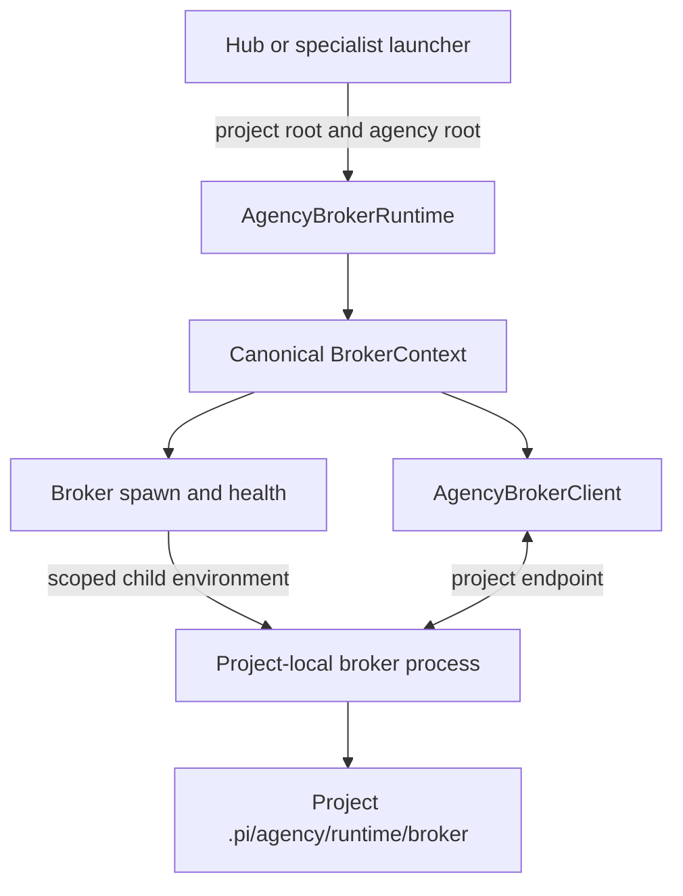
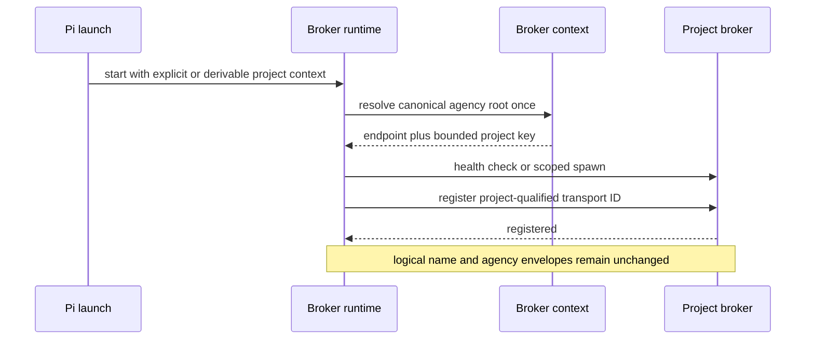
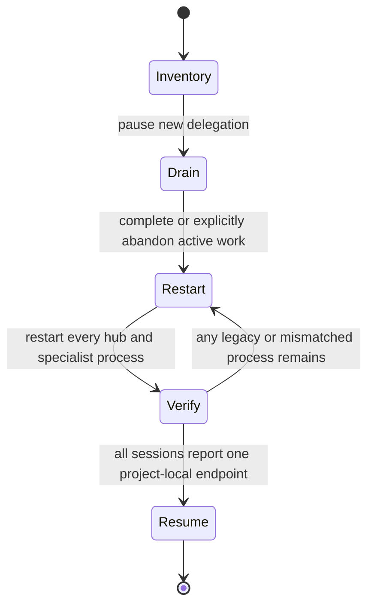

# Agency Broker Project Isolation - Plan

## Goal Capsule

- **Objective:** Ensure every Multi-Agency orchestrator and specialist connects only to the broker owned by its initialized project, even when multiple projects use identical logical agent names concurrently.
- **Authority:** The confirmed runtime diagnosis and the user-approved defense-in-depth scope in this plan supersede the global broker fallback behavior introduced by the original broker migration.
- **Execution profile:** Standard cross-cutting fix across TypeScript broker context, Python launch generation, integration coverage, and operator documentation.
- **Stop conditions:** Stop if the implementation would require automatic termination of existing broker processes, live migration of connected sessions, or a generic reconnect/shutdown redesign.
- **Tail ownership:** Implementation is complete only after both TypeScript and Python suites pass and a two-project regression proves stable isolation.

---

## Product Contract

### Summary

This plan replaces ambient, user-global broker discovery with an explicit project-scoped broker context, propagates that context before every managed Pi process starts, and qualifies transport identities without changing logical agency names or message envelopes. Existing sessions move forward through a documented whole-cohort restart; the implementation does not kill or migrate live global brokers.

### Problem Frame

The extension currently knows the initialized project root but does not use it to select the broker endpoint. When `AGENCY_ROOT` and `AGENCY_PROJECT_ROOT` are absent from a Pi process, `extensions/multi-agency/broker/paths.ts` falls back to `~/.pi/agent/agency-broker`. Every orchestrator then registers the deterministic transport ID `agency:orchestrator`.

The broker intentionally replaces an existing socket when the same transport ID registers again. Two orchestrators in different projects therefore evict each other, and each runtime reconnects after two seconds. Live observation confirmed socket ownership alternating between the Easy Apply and Multi-Agency orchestrators while the broker process itself remained healthy.

Generated hub and specialist commands do not currently place project context in the Pi process environment before extension startup. Prompt text that says to export `AGENCY_ROOT` cannot modify the already-running Pi process, so it cannot repair broker selection.

### Requirements

#### Project isolation

- R1. Every managed orchestrator and specialist must resolve a canonical owning project root and its canonical agency root, then use a broker runtime directory beneath that agency root.
- R2. An agency runtime must never attach to the user-global broker merely because project environment variables are absent.
- R3. Two initialized projects with identical logical agent names must maintain independent broker endpoints, rosters, replacement behavior, and message delivery.
- R4. Two sessions with the same logical identity inside the same canonical owning project must retain the current replacement semantics.
- R5. Endpoint ownership must derive from the agency root and transport identity from the owning project root; neither may derive from pane cwd, project basename, or logical agent name.

#### Launch and context propagation

- R6. Canonical hub and specialist launch commands must set both `AGENCY_ROOT` and `AGENCY_PROJECT_ROOT` before Pi starts and before the extension is imported.
- R7. Reference-repository specialists must use the originating project's agency root while retaining the reference checkout as execution cwd.
- R8. A plain Pi launch inside an initialized project must derive the same project broker context from the extension's resolved project root when explicit environment is absent.
- R9. If no canonical agency root can be established, broker connection must remain unavailable with an actionable diagnostic rather than falling back globally.

#### Compatibility and rollout

- R10. Project qualification must affect transport/session identity only; `intercomName`, role, message `from`/`to`, ACL behavior, ledger rows, inbox names, and tool-facing output must remain unchanged.
- R11. The wire schema remains protocol-compatible unless implementation introduces a new registration or health field; session-ID qualification alone must not trigger a protocol-version bump.
- R12. Existing global brokers and connected legacy sessions must not be discovered, killed, or migrated automatically.
- R13. Rollout instructions must require a full Pi process restart for sessions started without project context and a coordinated restart of the project's complete agency cohort.
- R14. Generic reconnect backoff, in-flight connection cancellation, and shutdown-race redesign remain outside this fix.

#### Platform and verification

- R15. Unix sockets, Windows named pipes, and opt-in Windows TCP mode must derive distinct endpoints and runtime files for distinct canonical agency roots.
- R16. Tests must cover endpoint precedence, canonicalization, generated launch context, same-project replacement, cross-project isolation, reference-repository cwd, and global-broker non-interference.
- R17. Every agency pane must expose a read-only local broker-context diagnostic showing its canonical project root, agency root, endpoint, bounded project key, and connection state; user and contributor documentation must use that diagnostic during restart verification.
- R18. Project-scoped runtime creation must preserve the existing owner-only Unix directory/file modes and Windows TCP state credential; Windows named-pipe access remains within the current-user local process trust boundary and requires manual platform validation when CI is unavailable.

### Acceptance Examples

- AE1 (R1, R3). Given two initialized projects with an `orchestrator` and `scout` in each, when all four sessions connect concurrently, both project rosters remain stable and messages are delivered only within the addressed project.
- AE2 (R3, R4). Given an active `orchestrator` in each of two projects, when project A starts a replacement `orchestrator`, only project A's prior socket closes; project B stays connected.
- AE3 (R6). Given canonical hub and specialist launch generation, when the final Pi command is inspected, both project variables are established before the Pi executable and not only mentioned in the boot prompt.
- AE4 (R7). Given a Scout launched in a reference checkout, when its broker context resolves, it uses the originating project's agency root while its registered cwd remains the reference checkout.
- AE5 (R8, R9). Given a plain Pi process in an initialized project with no explicit agency environment, when the extension initializes, it derives the project-local context; outside an initialized project, it stays disconnected with guidance instead of using the global broker.
- AE6 (R10). Given project-qualified transport IDs, when agents list sessions and exchange delegate, progress, ask, reply, report, and release messages, logical names and envelope identities remain unchanged.
- AE7 (R12, R13). Given an already-running global broker, when a fully restarted project cohort starts under the fixed version, its local broker works while the global process remains untouched.
- AE8 (R15, R18). Given two canonical roots with the same final directory name, when Unix, Windows pipe, and Windows TCP endpoints are derived, each transport produces distinct project-owned runtime state without weakening existing runtime-file protections.
- AE9 (R17). Given a restarted project cohort, when `/agency-broker-status` is run in each pane, every member reports the same project key and project-local endpoint family before delegation resumes.

### Scope Boundaries

#### In scope

- Canonical agency-root and broker-context derivation.
- Explicit context injection through broker runtime, client, spawn, hub launch, and specialist launch boundaries.
- Project-qualified transport IDs with preserved logical agency identities.
- Unit, integration, parity, and generated-command tests.
- Forward-only whole-cohort restart documentation.

#### Deferred to Follow-Up Work

- Exponential reconnect backoff and jitter.
- Cancellation or generation guards for shutdown during an in-flight connect.
- Seamless migration or dual registration for already-connected legacy sessions.
- Automated cleanup of user-global broker PID/socket files.
- Durable broker-namespace generation fields in `sessions.json` for mixed-version detection.

#### Outside this fix

- Cross-machine broker transport.
- Hostile same-account process isolation or broker admission credentials; this fix protects trusted local agency sessions from accidental cross-project collision and misconfiguration.
- Changes to agent role naming, peer ACL policy, message envelope fields, or filesystem fallback semantics.
- Automatic termination or forced restart of user processes.

---

## Planning Contract

### Key Technical Decisions

- KTD1. **Separate project identity from agency-state location.** The canonical owning project root produces the bounded transport namespace; its canonical agency root selects broker runtime state. Managed launches require both values to describe the same `<project>/.pi/agency` relationship. Pane cwd is execution context only.
- KTD2. **Replace ambient endpoint lookup with an immutable broker context.** The runtime derives both canonical roots once and passes the broker directory, endpoint inputs, runtime-file paths, bounded project key, and connection diagnostic through client and spawn boundaries. Endpoint-derived module globals must not remain the operational source of truth.
- KTD3. **Propagate context in process launch, then derive defensively at runtime.** (session-settled: user-approved — chosen over launch-only propagation: managed commands must be correct while plain initialized-project launches remain safe.)
- KTD4. **Qualify transport IDs, not domain identities.** (session-settled: user-approved — chosen over relying on endpoint isolation alone: a project-root-qualified transport ID prevents cross-project eviction when sessions accidentally meet, while root-consistency validation prevents them from intentionally sharing an endpoint.) Logical names may still be ambiguous on a misconfigured shared endpoint, so identity qualification never substitutes for endpoint isolation.
- KTD5. **Preserve same-project replacement.** The bounded owning-project key and logical name form a stable transport identity, so reloading the same agent still replaces its stale socket.
- KTD6. **Canonicalize roots consistently before hashing or endpoint derivation.** Resolve existing filesystem aliases, normalize platform-specific path representation, and use a deterministic lexical fallback only for a root that does not yet exist. TypeScript and Python launch expectations must agree.
- KTD7. **Keep transport-specific paths bounded and protected.** Unix runtime files remain under the project agency root with existing owner-only modes; Windows pipe names use the bounded project key rather than an unbounded sanitized absolute path; TCP port state remains project-local and credentialed.
- KTD8. **Use forward-only cohort restart.** (session-settled: user-approved — chosen over live migration or automatic broker termination: existing process environments and imported endpoint constants cannot be repaired safely in place.)
- KTD9. **Do not bump the broker protocol for a local session-ID and diagnostic change.** Revisit protocol versioning only if implementation adds a project field to broker wire messages or health authentication.
- KTD10. **Retain the trusted-local threat boundary.** Project scoping prevents accidental same-user cross-project collisions; it does not authenticate hostile local processes that can already access another project's runtime endpoint.

### Resolution Precedence

1. A valid explicit `AGENCY_PROJECT_ROOT` establishes the owning project identity; its expected agency root is `<project>/.pi/agency`.
2. A valid explicit `AGENCY_ROOT` selects agency state only when it matches the canonical expected agency root. If only `AGENCY_ROOT` is supplied, derive and validate the owning project from the conventional `.pi/agency` relationship.
3. Otherwise, project discovery walks upward for the nearest `.pi/agency` marker before accepting a generic package boundary, then derives both roots from that initialized ancestor.
4. Any conflict between supplied or discovered ownership inputs fails closed with an actionable diagnostic.
5. If no canonical ownership can be established, the agency broker runtime stays disconnected instead of using the global broker.
6. `cwd` never overrides the owning project or agency root.

### High-Level Technical Design

#### Component topology

#### Connection and identity sequence

#### Forward-only rollout lifecycle

### Sequencing

1. Establish a testable broker-context contract and platform path behavior.
2. Thread the context through runtime, client, spawn, and broker startup before changing transport IDs.
3. Update hub and specialist launch generation so managed processes receive the same context before extension startup.
4. Prove two-project isolation and same-project replacement through integration coverage.
5. Update operator and contributor documentation to match the verified launch and rollout behavior.

### System-Wide Impact

- **Agent routing:** All orchestrator and specialist traffic becomes project-local without changing logical names or tool APIs.
- **Process startup:** Hub, specialist, recovery, and direct initialized-project launches must converge on the same broker context.
- **Runtime files:** Each project owns its socket or port state, PID file, and spawn lock beneath its agency root.
- **Reference repositories:** Execution cwd may differ from ownership; explicit project context must survive that split.
- **Operations:** Partial rollout can temporarily split a cohort. Operators must restart the entire project's agency processes before resuming delegation.
- **Security posture:** Endpoint isolation, independent transport identity, and root-consistency validation prevent accidental cross-project message routing and eviction among trusted local sessions. Hostile same-account processes remain outside the broker's trust boundary.

### Risks and Mitigations

- **Canonicalization drift:** Python and TypeScript could derive different keys from symlinks or Windows aliases. Mitigate with shared fixtures and equivalent path-contract tests.
- **Import-time state survives refactor:** A leftover module constant could keep one endpoint globally cached. Mitigate by testing two contexts in one test process and reviewing all broker path consumers.
- **Reference-repository misbinding:** Deriving from cwd would attach Scout to the reference project. Mitigate by making agency root authoritative and testing divergent owner/cwd paths.
- **Partial rollout:** Reloading only one process can split the project cohort. Mitigate through explicit drain/restart/verify instructions; do not claim reload alone repairs a missing process environment.
- **Socket or pipe path limits:** Absolute-path-derived names can exceed platform limits. Mitigate with a bounded project key and project-local runtime directory.
- **Over-broad compatibility change:** Qualifying logical names would break ledger and ACL behavior. Mitigate with envelope parity assertions and unchanged logical session fields.
- **Global broker interference:** New sessions could accidentally reconnect globally. Mitigate by removing runtime use of the global fallback and running regression coverage while a global broker remains available.

### Sources and Research

- `docs/plans/2026-07-13-003-refactor-messaging-layer-to-intercom-broker-plan.md` — original broker contract, stable identity intent, and reconnect expectations.
- `extensions/multi-agency/broker/paths.ts` — current environment precedence and user-global fallback.
- `extensions/multi-agency/broker-runtime.ts` — project root availability, deterministic session ID, and two-second reconnect behavior.
- `extensions/multi-agency/broker/broker.ts` — duplicate-session replacement semantics.
- `extensions/multi-agency/broker/spawn.ts` — import-time broker paths and detached broker environment.
- `extensions/multi-agency/index.ts` — project-root discovery and scoped Python subprocess environment.
- `agency/scripts/agency_ctl.py` and `agency/scripts/pi_launch.py` — generated hub and specialist commands.
- `extensions/multi-agency/test/broker.integration.test.ts` — current single-root integration pattern and missing multi-project regression.

---

## Implementation Units

### U1. Define canonical broker context and project endpoint contract

- **Goal:** Provide one immutable, testable source of project identity, agency-state ownership, endpoint, runtime-file paths, and bounded project key.
- **Requirements:** R1, R2, R5, R8, R9, R15, R18; KTD1, KTD2, KTD6, KTD7.
- **Dependencies:** None.
- **Files:**
  - `extensions/multi-agency/index.ts`
  - `extensions/multi-agency/broker/paths.ts`
  - `extensions/multi-agency/test/paths.test.ts` (new)
- **Approach:** Extend the broker path layer with an explicit context factory that accepts project root, agency root, environment, and platform inputs. Make project discovery prefer an ancestor containing `.pi/agency` over a nearer package-only boundary. Validate the canonical relationship between owning project and agency state, remove the global fallback from managed runtime resolution, and produce a bounded project key for identity and Windows endpoint names. Keep pure helpers injectable so tests do not mutate process-global environment or depend on import ordering.
- **Patterns to follow:** Pure platform/path helper parameters in `extensions/multi-agency/broker/paths.ts` and explicit dependency inputs in `extensions/multi-agency/test/spawn.test.ts`.
- **Test scenarios:**
  1. Consistent explicit absolute roots establish the project identity and agency endpoint.
  2. Relative roots resolve predictably against the supplied owning project context.
  3. Conflicting explicit project and agency roots fail closed.
  4. `AGENCY_PROJECT_ROOT` derives `<project>/.pi/agency` when `AGENCY_ROOT` is absent.
  5. An initialized ancestor is discovered from a nested package with its own `package.json` when both variables are absent.
  6. No initialized root returns an unavailable context and never resolves `~/.pi/agent/agency-broker`.
  7. Symlinked and canonical paths for the same existing project produce the same project key.
  8. Distinct project roots with identical basenames produce distinct keys and endpoints.
  9. Unix socket, Windows named-pipe, and Windows TCP port-state derivation remain project-distinct and bounded.
  10. Unix runtime directories and files retain owner-only modes; Windows TCP state retains endpoint credentials.
- **Verification:** Context derivation is deterministic, platform-aware, independent of cwd, fail-closed on ownership mismatch, and directly testable for multiple projects in one process.

### U2. Thread broker context through runtime, client, spawn, and identity

- **Goal:** Make every broker operation consume the same project context and prevent cross-project session replacement.
- **Requirements:** R1-R5, R10-R12, R15, R17, R18; KTD2, KTD4, KTD5, KTD7, KTD9, KTD10.
- **Dependencies:** U1.
- **Files:**
  - `extensions/multi-agency/index.ts`
  - `extensions/multi-agency/broker-runtime.ts`
  - `extensions/multi-agency/broker/client.ts`
  - `extensions/multi-agency/broker/spawn.ts`
  - `extensions/multi-agency/broker/broker.ts`
  - `extensions/multi-agency/test/broker-runtime.test.ts` (new)
  - `extensions/multi-agency/test/spawn.test.ts`
  - `extensions/multi-agency/test/broker.integration.test.ts`
- **Approach:** Inject the resolved broker context into client connection and spawn/health operations, remove endpoint-derived module globals from operational code, and pass both canonical roots into the detached broker process environment. Build transport IDs from the bounded owning-project key plus logical name while endpoint state remains agency-root-scoped. Preserve all logical registration and message fields and keep same-project duplicate replacement unchanged. Expose the runtime's local context and connection state through a read-only `/agency-broker-status` command without adding broker wire fields.
- **Execution note:** Start with a failing two-context regression that demonstrates one project's replacement cannot disconnect the other.
- **Patterns to follow:** Existing `AgencyBrokerClient` constructor/connection isolation, spawn helper injection, temporary-root integration cleanup, and `try/finally` client disconnects.
- **Test scenarios:**
  1. Two broker contexts can be created and health-checked in one test process without environment mutation or module re-imports.
  2. A detached broker receives the exact owning roots used by its client context.
  3. Two projects register `orchestrator` concurrently and receive distinct transport IDs while retaining the logical name.
  4. Re-registering `orchestrator` in project A closes only project A's prior socket.
  5. Project B remains connected through project A replacement and reconnect activity.
  6. Logical sender validation, ACL decisions, presence, listing, and message envelopes remain unchanged.
  7. A running user-global broker does not satisfy project broker health checks or receive project registrations.
  8. `/agency-broker-status` reports the local canonical roots, bounded key, endpoint, and connection state without broker round trips.
  9. Protocol version remains unchanged when only the local transport ID and diagnostic change.
- **Verification:** Runtime, health, spawn, registration, reconnect, and diagnostic paths use the injected project context; no operational endpoint is selected from ambient global fallback state.

### U3. Propagate project context through every managed Pi launch

- **Goal:** Ensure hub and specialist processes receive project ownership before extension startup, including reference-repository and recovery launches.
- **Requirements:** R6-R9, R13, R16; KTD3, KTD6, KTD8.
- **Dependencies:** U1.
- **Files:**
  - `agency/scripts/agency_ctl.py`
  - `agency/scripts/pi_launch.py`
  - `agency/scripts/agent_spawn.py`
  - `agency/scripts/tests/test_agency_ctl_parity.py`
  - `agency/scripts/tests/test_pi_launch.py`
  - `agency/scripts/tests/test_agent_spawn.py`
- **Approach:** Extend the shared Pi launch builder to accept owning project context and emit it in the final process launch before `pi`. Use that builder for specialist and recovery paths; include the same context in the canonical hub command. Keep bootstrap prose as explanatory redundancy, not as the transport configuration mechanism. Preserve execution cwd independently from ownership roots.
- **Execution note:** Verify the final generated command boundary rather than only checking intermediate Python subprocess environments or prompt text.
- **Patterns to follow:** Existing shell quoting in `agency/scripts/pi_launch.py`, project-root resolution in `agency/scripts/agency_paths.py`, and pytest `tmp_path`/`monkeypatch` fixtures.
- **Test scenarios:**
  1. Canonical hub command establishes both roots before starting Pi.
  2. Temporary and persistent specialist commands establish both roots before starting Pi.
  3. A reference-repository specialist uses the reference path for `cd` and the owning project for both agency variables.
  4. Paths containing spaces or quotes remain shell-safe.
  5. Recovery respawn uses the same launch builder and project context as initial spawn.
  6. Bare non-agency launch-builder use remains available only where callers do not install the agency extension.
  7. Bootstrap text does not claim that a prompt-time export configures the parent Pi process.
- **Verification:** Every supported managed agency launch path produces one authoritative ownership context before extension import, with no separate recovery or reference-repository derivation.

### U4. Prove cross-project isolation and compatibility end to end

- **Goal:** Convert the observed eviction loop into a permanent behavioral regression suite.
- **Requirements:** R3, R4, R7, R10-R12, R15, R16, R18; AE1-AE8.
- **Dependencies:** U2, U3.
- **Files:**
  - `extensions/multi-agency/test/broker.integration.test.ts`
  - `extensions/multi-agency/test/messages.test.ts`
  - `agency/scripts/tests/test_pi_launch.py`
  - `agency/scripts/tests/test_agent_spawn.py`
- **Approach:** Run two independently scoped brokers and identically named client cohorts concurrently. Assert project-local list/delivery, same-project replacement, no cross-project disconnect, logical-envelope parity, and coexistence with an untouched global broker. Keep Windows transport checks at the pure path/context layer when Windows runtime CI is unavailable.
- **Test scenarios:**
  1. Delegate and report round trips stay inside each project with identical logical names.
  2. Ask/reply correlation stays project-local under concurrent traffic.
  3. Progress and release messages do not cross project boundaries.
  4. Same-project replacement emits the expected local disconnect while the other project observes none.
  5. Repeated reconnect windows do not alternate endpoint ownership across projects.
  6. Project-local listing returns no sessions from the other root.
  7. Logical message `from`/`to` values match pre-fix behavior despite qualified transport IDs.
  8. Project brokers start and communicate while a user-global broker remains alive and unchanged.
- **Verification:** The test fails against the current global-socket implementation and passes only when endpoint and identity isolation both hold.

### U5. Document project ownership and forward-only rollout

- **Goal:** Make correct launch, reference-repository, and upgrade behavior discoverable without relying on tribal knowledge.
- **Requirements:** R12-R14, R17, R18; KTD8, KTD10.
- **Dependencies:** U2, U3, U4.
- **Files:**
  - `README.md`
  - `CONTRIBUTING.md`
  - `docs/architecture.md`
  - `docs/architecture.html`
  - `skills/agency-orchestrator/SKILL.md`
  - `agency/skills/orchestrator/SKILL.md`
  - `agency/charters/orchestrator.md`
  - `agency/charters/scout.md`
  - `agency/charters/brainstorm.md`
  - `agency/charters/planner.md`
  - `agency/charters/worker.md`
  - `agency/charters/debug.md`
  - `agency/charters/coderev.md`
  - `agency/charters/docrev.md`
- **Approach:** State the invariant that an initialized project owns one broker runtime beneath its agency root. Update canonical launch examples to establish both roots, explain that reference-repository cwd does not change ownership, distinguish full process restart from extension reload, and document pause/drain/restart/verify/resume rollout using `/agency-broker-status` in every cohort pane. Define the trusted-local threat boundary, keep manual global-broker cleanup optional, and never instruct the software to kill it automatically. Synchronize the Markdown architecture source and living HTML board.
- **Test expectation:** No new behavioral tests; documentation assertions in U3 and U4 prove the described commands and invariants.
- **Verification:** All authoritative and scaffolded guidance agrees on project ownership, both launch variables, whole-cohort restart, and deferred reconnect work.

---

## Verification Contract

| Gate | Applies to | Command or evidence | Pass condition |
|---|---|---|---|
| TypeScript broker suite | U1, U2, U4 | `npm run test:broker` | Path, spawn, framing, messaging, and two-project integration tests pass without leaked broker processes. |
| Python control-plane suite | U3, U4, U5 | `python3 -m pytest agency/scripts/tests` | Hub, specialist, recovery, quoting, and parity tests pass. |
| Python syntax | U3 | `python3 -m py_compile agency/scripts/*.py` | All modified launch/control scripts compile. |
| Isolation regression | U2, U4 | Two concurrent temporary agency roots with identical logical identities | Both cohorts remain connected; list and delivery are project-local; same-project replacement does not affect the other root. |
| Global compatibility | U2, U4 | Isolation regression with a user-global broker already running | Project brokers ignore it and the global process remains untouched. |
| Platform derivation and access | U1, U2, U4 | Pure Unix, Windows pipe, and Windows TCP fixtures plus manual Windows ACL validation when CI is unavailable | Distinct canonical roots produce distinct bounded endpoints and runtime files without weakening existing access controls. |
| Cohort diagnostic | U2, U5 | `/agency-broker-status` in every restarted pane | Every cohort member reports the expected canonical roots, bounded project key, project-local endpoint, and connected state before delegation resumes. |
| Documentation consistency | U5 | Review all listed launch and architecture surfaces | No source recommends prompt-time export as process configuration or implies that reload repairs a missing environment. |
| Diff hygiene | All | `git diff --check` | No whitespace errors or unrelated source changes. |

Windows execution remains a manual residual when no Windows CI runner is available; pure derivation tests are mandatory in all environments.

---

## Definition of Done

- R1-R18 and AE1-AE9 are satisfied with traceable unit or integration coverage.
- U1-U5 meet their verification outcomes.
- Two concurrently active projects can use identical logical agent names without socket eviction, cross-talk, or shared runtime files.
- Direct initialized-project launches and generated hub/specialist launches resolve the same canonical agency root.
- Same-project reload replacement semantics and logical agency message identities remain compatible.
- Existing user-global broker processes are neither selected nor terminated by project-scoped runtimes.
- The rollout documentation requires full restart for legacy process environments and whole-cohort verification before delegation resumes.
- Generic reconnect/backoff and live-migration work remains absent from the implementation diff and visible as deferred follow-up.
- No abandoned compatibility shim, dual-registration path, or experimental namespace code remains in the final diff.
